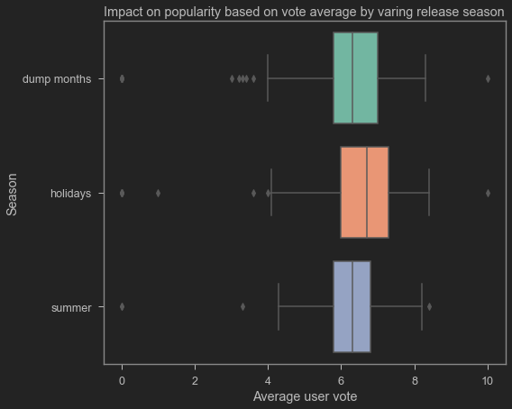

Final Project Submission

>* Student name: Tamjid Ahsan
>* Student pace: full time
>* Scheduled project review date/time: 
>* Instructor name: James Irving
>* Blog post URL:


# Overview

A handful of companies have defined the Hollywood film industry, dominating the US and world markets. They have weathered a world war, and a Great Depression and few moderate ones, innovated wide screen and color technologies, made peace with television, learned to exploit home video and online streaming, and are more powerful than ever before.

Most big corporations are already in this business or exploring feasibility of entry. Most of the major corporations operating only in this industry are thriving. 

# Business Problem

Microsoft sees all the big companies creating original video content and they want to get in on the fun. They have decided to create a new movie studio, but they don’t know anything about creating movies.

I am going to try to figure out what types of films are currently performing better at the box office. I shall recommend some actionable insights based on findings of this analysis, which the head of Microsoft's new movie studio can use to help decide what type of films to create.


Areas of focus:

    * movie generes.
    * profitability of success based on seasonality of releases.
    * profitabilty of movie franchise/film series.

# The imports

## Packages and Libraries


```python
# for web scraping and API calls
from selenium import webdriver
from selenium.webdriver.common.keys import Keys
from selenium.webdriver.support import expected_conditions as EC
from selenium.webdriver.common.by import By
from selenium.webdriver.support.wait import WebDriverWait
import os
import wget
import tmdbsimple as tmdb
```


```python
# for other parts
import os
import pandas as pd
import numpy as np
import matplotlib.pyplot as plt
%matplotlib inline
import seaborn as sns
import json
import requests
import time
from pandas.core.common import flatten
from pandasql import sqldf
import plotly.graph_objects as go
from plotly.subplots import make_subplots
import re
import ast
```


```python
# styling (jupyter-themes must be installed)
## https://github.com/dunovank/jupyter-themes
from jupyterthemes import jtplot
# jt -r # default
jtplot.style(theme='monokai', context='notebook', ticks='True', grid='False')

# jt -t monokai -fs 120 -tfs 120 -nfs 115 -cellw 85% -T -N -kl # my setup
```


```python
# to see dataframe better
pd.set_option('display.max_columns', 50)
```

## Frequently used fuctions


```python
# Number formatter
def format_number(data_value, index):
    if data_value >= 1_000_000_000:
        formatter = '${:1.1f}B'.format(data_value*0.000_000_001)
    elif data_value >= 1_000_000:
        formatter = '${:1.0f}M'.format(data_value*0.000_001)
    else:
        formatter = '${:1.0f}K'.format(data_value*0.001)
    return formatter
```


```python
# % formatter
def format_add_percentage(data_value, index):
    formatter = '{:.0f}%'.format(data_value)
    return formatter
```


```python
 def correlation_top_bottom(df):
    corr_df_matrix_ = df.unstack().reset_index()
    corr_df_matrix_.columns = ["feature_0", 'feature_1', 'correlation']
    corr_df_matrix_['keep'] = corr_df_matrix_.apply(
        lambda x: False if x['feature_0'] == x['feature_1'] else True, axis=1)
    corr_df_matrix_['feature_combo'] = corr_df_matrix_.apply(
        lambda x: ' and '.join(set(x[['feature_0', 'feature_1']])), axis=1)
    corr_featurs = corr_df_matrix_[corr_df_matrix_.keep][[
        'feature_combo', 'correlation'
    ]].drop_duplicates().sort_values(by='correlation', ascending=False)
    print(
        f'Positive correlations:\n\
        {corr_featurs.head(10).reset_index()}\n\n {"-"*70}\n\
        Negative correlations:\n\
        {corr_featurs.sort_values(by="correlation").head(10).reset_index()}'
    )
```

## API and Scraping control

Set this to `True` to perform scraping and API

```python
initialize_scraping_and_API = True
```


```python
initialize_scraping_and_API = False
```

# The Data

* [IMDb](https://www.imdb.com/) or <i>Internet Movie Database</i> was Originally a fan-operated website, now owned and operated by IMDb.com, Inc., a subsidiary of Amazon. This is one of the most reliable sourec for any information related movies in general. It is one of the most comprehensive dataset.
* [Box Office Mojo](https://www.boxofficemojo.com/) is also a part of IMDb.com, Inc., providing indepth financial informations among other metrics.
* [TMDb](https://www.themoviedb.org/) is a reliable source for movie related information. This is a popular user editable database for movies and TV shows.

Those three were used for sourcing data for the project as those are highly reliable sources without going for any paid service for information.
            

Data is collected from [IMDB website](https://datasets.imdbws.com) from downloadables, and scraping using [selenium](https://www.selenium.dev/) .
Additional data collected from TMDb using [API](https://www.themoviedb.org/documentation/api).
Then all of them are merged to create <b>'main_df'</b>, upon which this following analysis is performed.

## From IMDb

### Dataset from website

File containing detailed movie info inside [title.basics.tsv.gz](https://datasets.imdbws.com/title.basics.tsv.gz) was downloaded from `https://datasets.imdbws.com/title.basics.tsv.gz`

### Scraping using selenium


```python
pip install selenium
```
Download webdriver from [here](https://sites.google.com/a/chromium.org/chromedriver/downloads).


```python
%%time
if initialize_scraping_and_API is True:
    # initializing webdriver
    driver = webdriver.Chrome('C:/Users/tamji/Documents/PATH/chromedriver.exe')
    # connection to webpage
    base_url_string = 'https://www.boxofficemojo.com/year/world/'
    # selecting years to get
    list_of_year = np.arange(2014, 2022, 1)
    # initializing scraping
    print(f'+' * 100)
    # temp files
    file_names_ = []
    file_names_error = []
    # scraping
    for im in list_of_year:
        print(f'Working on: {im}')
        url = f'{base_url_string}{im}/'
        print(f'Getting {im} homepage')
        driver.get(url)
        table = driver.find_element_by_xpath('//*[@id="table"]/div/table[2]')
        item_href = driver.find_elements_by_class_name('a-link-normal')
        print(f'Getting {im} list items')
        item_href = [item.get_property('href') for item in item_href]
        print(f'Sorting what to keep from {im} list items')
        # filter results to target needed links
        text_to_check = 'releasegroup'
        to_keep = []
        to_discard = []
        for i in item_href:
            if text_to_check in i:
                to_keep.append(i)
            else:
                to_discard.append(i)
        print(f'Preping {im} list items for looping')
        href = to_keep # [:2] is for testing, remove this to get full data
        master_list = []
        error = []
        print(f'{im} list items are looping. Hang in there!')
        for item in href:
            try:
                driver.get(item)
                url = driver.find_element_by_xpath(
                    '//*[@id="title-summary-refiner"]/a').get_property('href')
                name = driver.find_element_by_xpath(
                    '//*[@id="a-page"]/main/div/div[1]/div[1]/div/div/div[2]/h1'
                ).text

                driver.get(url)
                year = driver.find_element_by_xpath(
                    '//*[@id="a-page"]/main/div/div[1]/div[1]/div/div/div[2]/div/h1/span'
                ).text
                worldwide = driver.find_element_by_xpath(
                    '//*[@id="a-page"]/main/div/div[3]/div[1]/div/div[3]/span[2]/span'
                ).text
                international = driver.find_element_by_xpath(
                    '//*[@id="a-page"]/main/div/div[3]/div[1]/div/div[2]/span[2]'
                ).text
                domestic = driver.find_element_by_xpath(
                    '//*[@id="a-page"]/main/div/div[3]/div[1]/div/div[1]/span[2]'
                ).text

                year_cleaned = year.strip('()')
                world_collection = worldwide[1:].replace(",", "")
                international_collection = international[1:].replace(",", "")
                domestic_collection = domestic[1:].replace(",", "")
                imdb_code = url.split('/')[4]

                temp_dict = {
                    'imdb_code': imdb_code,
                    'name': name,
                    'year': year_cleaned,
                    'world_collection': world_collection,
                    'int_collection': international_collection,
                    'dom_collection': domestic_collection,
                    'url': url
                }
                master_list.append(temp_dict)
            except:
                error.append(item)
                continue

        df = pd.DataFrame(master_list)
        file_name_df = f'{im}.csv'
        df.to_csv(file_name_df, index=False)
        dict_ = {'urls': error}
        file_name_error = f'{im}_error.csv'
        pd.DataFrame(dict_).to_csv(file_name_error, index=False)
        file_names_.append(file_name_df)
        file_names_error.append(file_name_error)
        print(f'Finished working on {im}\n')
        print(f'+' * 100)
    print(f'\n\n\nDONE Looping. Cleanig data!!!')

    combined_csv_data = pd.concat([pd.read_csv(f) for f in file_names_])
    combined_csv_data_error = pd.concat(
        [pd.read_csv(f) for f in file_names_error])

    combined_csv_data.reset_index(inplace=True)
    combined_csv_data_error.reset_index(inplace=True)

    combined_csv_data = combined_csv_data.drop(columns='index')
    combined_csv_data_error = combined_csv_data_error.drop(columns='index')

    combined_csv_data = combined_csv_data.drop_duplicates('imdb_code',
                                                          ignore_index=True)

    file_name_1 = f'{list_of_year[0]}to{list_of_year[-1]}.csv'
    file_name_2 = f'{list_of_year[0]}to{list_of_year[-1]}_error.csv'
    combined_csv_data.to_csv(file_name_1, index=False)
    combined_csv_data_error.to_csv(file_name_2, index=False)

    print(f'\n\n\nDONE!!!')
    print(f'+' * 100)
    print(f'+' * 100)
# leaves temp files behind
```

    Wall time: 0 ns
    


```python
# moving major files
if initialize_scraping_and_API is True:
    destination_1 = f'./Data/bom_{file_name_1}'
    destination_2 = f'./Data/temp/{file_name_2}'
    os.rename(file_name_1,destination_1)
    os.rename(file_name_2,destination_2)
```


```python
def move_files(file):
    destination = f'./Data/temp/{file}'
    os.rename(file,destination)
```


```python
# moving temp files
if initialize_scraping_and_API is True:
    if True:
        [move_files(f) for f in file_names_]
        [move_files(f) for f in file_names_error]
        print('Done moving!!')
```

Note: ***repo does not include temp files***

## From TMDb API


```python
# load json
if initialize_scraping_and_API is True:
    def get_keys(path):
        with open(path) as f:
            return json.load(f)
```


```python
# api key initialize
if initialize_scraping_and_API is True:
    keys = get_keys("/Users/tamji/.secret/tmdb_api.json")
    api_key = keys['api_key']
```


```python
if initialize_scraping_and_API is True:
    tmdb.API_KEY = api_key
```


```python
# movie_main_df_sliced is cleaned beforehand
if initialize_scraping_and_API is True:
    # for matching imdb titles 
    movie_titles_df = pd.read_csv(r'./Data/movie_main_df_sliced.csv',
                                  usecols=["tconst"])
```


```python
# preparing loaded data for use
if initialize_scraping_and_API is True:
    imdb_titles = list(flatten(movie_titles_df.values.tolist()))
```


```python
# get how much data is incoming
if initialize_scraping_and_API is True:
    len(imdb_titles)
```


```python
# empty df to store results
if initialize_scraping_and_API is True:
    df = pd.DataFrame()
```


```python
if initialize_scraping_and_API is True:
    for imdb_id in imdb_titles:    
        try:
            movie = tmdb.Movies(imdb_id)
            response = movie.info()
            df = df.append(pd.json_normalize(movie.info()))
        except:
            pass
```


```python
if initialize_scraping_and_API is True:
    df = df.reset_index()
```


```python
if initialize_scraping_and_API is True:
    df = df.drop(columns=['index'])
```


```python
if initialize_scraping_and_API is True:
    df.to_csv(r'./Data/tmdb_parsd.csv')
```

# Preparing datasets

## IMDb

### loading


```python
%%time
df_1 = pd.read_csv(r'./Data/data.tsv',
                   delimiter='\t',
                   low_memory=False)
```

    Wall time: 17.5 s
    

### inspecting


```python
df_1.head(3)
```


<div>
<table border="1" class="dataframe">
  <thead>
    <tr style="text-align: right;">
      <th></th>
      <th>tconst</th>
      <th>titleType</th>
      <th>primaryTitle</th>
      <th>originalTitle</th>
      <th>isAdult</th>
      <th>startYear</th>
      <th>endYear</th>
      <th>runtimeMinutes</th>
      <th>genres</th>
    </tr>
  </thead>
  <tbody>
    <tr>
      <th>0</th>
      <td>tt0000001</td>
      <td>short</td>
      <td>Carmencita</td>
      <td>Carmencita</td>
      <td>0</td>
      <td>1894</td>
      <td>\N</td>
      <td>1</td>
      <td>Documentary,Short</td>
    </tr>
    <tr>
      <th>1</th>
      <td>tt0000002</td>
      <td>short</td>
      <td>Le clown et ses chiens</td>
      <td>Le clown et ses chiens</td>
      <td>0</td>
      <td>1892</td>
      <td>\N</td>
      <td>5</td>
      <td>Animation,Short</td>
    </tr>
    <tr>
      <th>2</th>
      <td>tt0000003</td>
      <td>short</td>
      <td>Pauvre Pierrot</td>
      <td>Pauvre Pierrot</td>
      <td>0</td>
      <td>1892</td>
      <td>\N</td>
      <td>4</td>
      <td>Animation,Comedy,Romance</td>
    </tr>
  </tbody>
</table>
</div>


```python
df_1['titleType'].value_counts()
```


    tvEpisode       5590798
    short            799028
    movie            570678
    video            297824
    tvSeries         203184
    tvMovie          130415
    tvMiniSeries      36270
    tvSpecial         31753
    videoGame         27529
    tvShort            9611
    radioSeries           1
    audiobook             1
    episode               1
    Name: titleType, dtype: int64


### cleaning


```python
%%time
# slicing to keep only movies
movie_df = df_1[df_1['titleType'] == 'movie']
# droping adult titles
movie_df = movie_df[movie_df['isAdult'] == '0']
# handeling nan values
movie_df.loc[movie_df['runtimeMinutes'] == r'\N', 'runtimeMinutes'] = np.nan
movie_df.loc[movie_df['startYear'] == r'\N', 'startYear'] = np.nan
movie_df.loc[movie_df['genres'] == r'\N', 'genres'] = np.nan
# setting nan genere to NoInfo
movie_df.loc[movie_df['genres'].isna(), 'genres'] = "NoInfo"
# nan value droping for start year
movie_df = movie_df[~movie_df['startYear'].isna()]

movie_df = movie_df.reset_index()
movie_df = movie_df.drop(['index', 'titleType', 'endYear', 'isAdult'], axis=1)

movie_df.to_csv(r'./Data/movie_df.csv', index=False)
movie_df
```

    Wall time: 2.37 s
    


<div>
<table border="1" class="dataframe">
  <thead>
    <tr style="text-align: right;">
      <th></th>
      <th>tconst</th>
      <th>primaryTitle</th>
      <th>originalTitle</th>
      <th>startYear</th>
      <th>runtimeMinutes</th>
      <th>genres</th>
    </tr>
  </thead>
  <tbody>
    <tr>
      <th>0</th>
      <td>tt0000502</td>
      <td>Bohemios</td>
      <td>Bohemios</td>
      <td>1905</td>
      <td>100</td>
      <td>NoInfo</td>
    </tr>
    <tr>
      <th>1</th>
      <td>tt0000574</td>
      <td>The Story of the Kelly Gang</td>
      <td>The Story of the Kelly Gang</td>
      <td>1906</td>
      <td>70</td>
      <td>Action,Adventure,Biography</td>
    </tr>
    <tr>
      <th>2</th>
      <td>tt0000615</td>
      <td>Robbery Under Arms</td>
      <td>Robbery Under Arms</td>
      <td>1907</td>
      <td>NaN</td>
      <td>Drama</td>
    </tr>
    <tr>
      <th>3</th>
      <td>tt0000630</td>
      <td>Hamlet</td>
      <td>Amleto</td>
      <td>1908</td>
      <td>NaN</td>
      <td>Drama</td>
    </tr>
    <tr>
      <th>4</th>
      <td>tt0000675</td>
      <td>Don Quijote</td>
      <td>Don Quijote</td>
      <td>1908</td>
      <td>NaN</td>
      <td>Drama</td>
    </tr>
    <tr>
      <th>...</th>
      <td>...</td>
      <td>...</td>
      <td>...</td>
      <td>...</td>
      <td>...</td>
      <td>...</td>
    </tr>
    <tr>
      <th>490999</th>
      <td>tt9916622</td>
      <td>Rodolpho Teóphilo - O Legado de um Pioneiro</td>
      <td>Rodolpho Teóphilo - O Legado de um Pioneiro</td>
      <td>2015</td>
      <td>57</td>
      <td>Documentary</td>
    </tr>
    <tr>
      <th>491000</th>
      <td>tt9916680</td>
      <td>De la ilusión al desconcierto: cine colombiano...</td>
      <td>De la ilusión al desconcierto: cine colombiano...</td>
      <td>2007</td>
      <td>100</td>
      <td>Documentary</td>
    </tr>
    <tr>
      <th>491001</th>
      <td>tt9916706</td>
      <td>Dankyavar Danka</td>
      <td>Dankyavar Danka</td>
      <td>2013</td>
      <td>NaN</td>
      <td>Comedy</td>
    </tr>
    <tr>
      <th>491002</th>
      <td>tt9916730</td>
      <td>6 Gunn</td>
      <td>6 Gunn</td>
      <td>2017</td>
      <td>116</td>
      <td>NoInfo</td>
    </tr>
    <tr>
      <th>491003</th>
      <td>tt9916754</td>
      <td>Chico Albuquerque - Revelações</td>
      <td>Chico Albuquerque - Revelações</td>
      <td>2013</td>
      <td>49</td>
      <td>Documentary</td>
    </tr>
  </tbody>
</table>
<p>491004 rows × 6 columns</p>
</div>


splitting genere


```python
%%time
# getting preliminary unique list for cleaning
genres = list(movie_df['genres'].unique())
# temp list to store list of splited genre
genre_cleaning_temp = []
# getting list of splited genre
for item in genres:
    # for dealing with nan
    if type(item) is not float:
        # actual spliting
        genre_split = item.split(",")
        # appending
        genre_cleaning_temp.extend(genre_split)
# geting unique list
from pandas.core.common import flatten
# flattening temp list
## https://stackoverflow.com/questions/12897374/get-unique-values-from-a-list-in-python by https://stackoverflow.com/users/2062318/todor ##
## https://saralgyaan.com/posts/nested-list-to-list-python-in-just-three-lines-of-code/ ##
genre_cleaning_temp = list(flatten(genre_cleaning_temp))
# unique genre list
unique_genre = list(dict.fromkeys(genre_cleaning_temp))

## overly complicated way, theres much simpler method out in the wild.
unique_genre
```

    Wall time: 29.5 ms
    
    ['NoInfo',
     'Action',
     'Adventure',
     'Biography',
     'Drama',
     'Fantasy',
     'Comedy',
     'War',
     'Documentary',
     'Crime',
     'Romance',
     'Family',
     'History',
     'Sci-Fi',
     'Thriller',
     'Western',
     'Short',
     'Sport',
     'Mystery',
     'Horror',
     'Music',
     'Animation',
     'Musical',
     'Film-Noir',
     'News',
     'Adult',
     'Reality-TV',
     'Game-Show',
     'Talk-Show']


```python
%%time
#boolian matrix for all genere
movie_genre_df = pd.DataFrame([[(x in y) for x in unique_genre]
                               for y in movie_df['genres']],
                              columns=unique_genre)
```

    Wall time: 2.43 s
    


```python
# merging
movie_main_df = pd.concat([movie_df, movie_genre_df], axis=1)
```


```python
# enforcing dtypes
movie_main_df = movie_main_df.convert_dtypes()
```


```python
movie_main_df.describe()
```


<div>
<table border="1" class="dataframe">
  <thead>
    <tr style="text-align: right;">
      <th></th>
      <th>tconst</th>
      <th>primaryTitle</th>
      <th>originalTitle</th>
      <th>startYear</th>
      <th>runtimeMinutes</th>
      <th>genres</th>
      <th>NoInfo</th>
      <th>Action</th>
      <th>Adventure</th>
      <th>Biography</th>
      <th>Drama</th>
      <th>Fantasy</th>
      <th>Comedy</th>
      <th>War</th>
      <th>Documentary</th>
      <th>Crime</th>
      <th>Romance</th>
      <th>Family</th>
      <th>History</th>
      <th>Sci-Fi</th>
      <th>Thriller</th>
      <th>Western</th>
      <th>Short</th>
      <th>Sport</th>
      <th>Mystery</th>
      <th>Horror</th>
      <th>Music</th>
      <th>Animation</th>
      <th>Musical</th>
      <th>Film-Noir</th>
      <th>News</th>
      <th>Adult</th>
      <th>Reality-TV</th>
      <th>Game-Show</th>
      <th>Talk-Show</th>
    </tr>
  </thead>
  <tbody>
    <tr>
      <th>count</th>
      <td>491004</td>
      <td>491004</td>
      <td>491004</td>
      <td>491004</td>
      <td>348729</td>
      <td>491004</td>
      <td>491004</td>
      <td>491004</td>
      <td>491004</td>
      <td>491004</td>
      <td>491004</td>
      <td>491004</td>
      <td>491004</td>
      <td>491004</td>
      <td>491004</td>
      <td>491004</td>
      <td>491004</td>
      <td>491004</td>
      <td>491004</td>
      <td>491004</td>
      <td>491004</td>
      <td>491004</td>
      <td>491004</td>
      <td>491004</td>
      <td>491004</td>
      <td>491004</td>
      <td>491004</td>
      <td>491004</td>
      <td>491004</td>
      <td>491004</td>
      <td>491004</td>
      <td>491004</td>
      <td>491004</td>
      <td>491004</td>
      <td>491004</td>
    </tr>
    <tr>
      <th>unique</th>
      <td>491004</td>
      <td>435498</td>
      <td>444525</td>
      <td>133</td>
      <td>470</td>
      <td>1317</td>
      <td>2</td>
      <td>2</td>
      <td>2</td>
      <td>2</td>
      <td>2</td>
      <td>2</td>
      <td>2</td>
      <td>2</td>
      <td>2</td>
      <td>2</td>
      <td>2</td>
      <td>2</td>
      <td>2</td>
      <td>2</td>
      <td>2</td>
      <td>2</td>
      <td>2</td>
      <td>2</td>
      <td>2</td>
      <td>2</td>
      <td>2</td>
      <td>2</td>
      <td>2</td>
      <td>2</td>
      <td>2</td>
      <td>2</td>
      <td>2</td>
      <td>2</td>
      <td>2</td>
    </tr>
    <tr>
      <th>top</th>
      <td>tt6096868</td>
      <td>Mother</td>
      <td>Home</td>
      <td>2017</td>
      <td>90</td>
      <td>Drama</td>
      <td>False</td>
      <td>False</td>
      <td>False</td>
      <td>False</td>
      <td>False</td>
      <td>False</td>
      <td>False</td>
      <td>False</td>
      <td>False</td>
      <td>False</td>
      <td>False</td>
      <td>False</td>
      <td>False</td>
      <td>False</td>
      <td>False</td>
      <td>False</td>
      <td>False</td>
      <td>False</td>
      <td>False</td>
      <td>False</td>
      <td>False</td>
      <td>False</td>
      <td>False</td>
      <td>False</td>
      <td>False</td>
      <td>False</td>
      <td>False</td>
      <td>False</td>
      <td>False</td>
    </tr>
    <tr>
      <th>freq</th>
      <td>1</td>
      <td>40</td>
      <td>36</td>
      <td>17755</td>
      <td>23507</td>
      <td>90267</td>
      <td>424787</td>
      <td>450544</td>
      <td>468879</td>
      <td>478159</td>
      <td>309787</td>
      <td>480389</td>
      <td>404506</td>
      <td>483095</td>
      <td>393223</td>
      <td>461821</td>
      <td>451561</td>
      <td>476778</td>
      <td>479702</td>
      <td>482990</td>
      <td>463182</td>
      <td>484426</td>
      <td>490966</td>
      <td>485607</td>
      <td>478308</td>
      <td>467678</td>
      <td>472317</td>
      <td>484749</td>
      <td>482077</td>
      <td>490222</td>
      <td>489618</td>
      <td>490968</td>
      <td>490625</td>
      <td>490989</td>
      <td>490894</td>
    </tr>
  </tbody>
</table>
</div>


```python
movie_main_df['startYear'] = movie_main_df['startYear'].astype('int')
movie_main_df['runtimeMinutes'].fillna('0', inplace=True)
movie_main_df['runtimeMinutes'] = movie_main_df['runtimeMinutes'].astype('int')
```


```python
movie_main_df['startYear'].sort_values().unique()
```


    array([1896, 1897, 1898, 1899, 1900, 1901, 1902, 1903, 1904, 1905, 1906,
           1907, 1908, 1909, 1910, 1911, 1912, 1913, 1914, 1915, 1916, 1917,
           1918, 1919, 1920, 1921, 1922, 1923, 1924, 1925, 1926, 1927, 1928,
           1929, 1930, 1931, 1932, 1933, 1934, 1935, 1936, 1937, 1938, 1939,
           1940, 1941, 1942, 1943, 1944, 1945, 1946, 1947, 1948, 1949, 1950,
           1951, 1952, 1953, 1954, 1955, 1956, 1957, 1958, 1959, 1960, 1961,
           1962, 1963, 1964, 1965, 1966, 1967, 1968, 1969, 1970, 1971, 1972,
           1973, 1974, 1975, 1976, 1977, 1978, 1979, 1980, 1981, 1982, 1983,
           1984, 1985, 1986, 1987, 1988, 1989, 1990, 1991, 1992, 1993, 1994,
           1995, 1996, 1997, 1998, 1999, 2000, 2001, 2002, 2003, 2004, 2005,
           2006, 2007, 2008, 2009, 2010, 2011, 2012, 2013, 2014, 2015, 2016,
           2017, 2018, 2019, 2020, 2021, 2022, 2023, 2024, 2025, 2026, 2027,
           2028])


### choosing features

*****Choosing to focus analysis on movies released between 2015 to 2020, where primary spoken language is English.*****

- In my opinion this is the most appropriate time frame to focus, as this gives enough data for analysis and at the same time does not include old info which will not be good representative of the current market situation. As customer/viewer taste and market trends shift over the time.

- Microsoft should focus only on releasing content in <b>English</b> for their kick-off. This gives them enough exposure and get noticed as a big player in the game, as they intend to be. Although they should focus on other territory to explore as there are ample opportunities left untapped. For example, in 2020 China surpassed North America in terms of industry value.\
As Microsoft has business across the globe, this should be relatively straight forward for them.

- I am also choosing not to focus on <b>ultra-low</b> budget movies for this analysis. Microsoft is one of the biggest corporations on earth. They have financial support to go for the big studios.
- I am also not including <b>'Documentary', 'Short', 'Adult', 'Reality-TV', 'Game-Show', 'Talk-Show', 'News', 'Film-Noir'</b> titles. Those are entirely different class of product to be compared with conventional movies.


```python
# filtering based on year, keeping one addtional year just to be safe
movie_main_df_sliced = movie_main_df[(movie_main_df['startYear'] >= 2014)
                                     & (movie_main_df['startYear'] <= 2021)]
```


```python
movie_main_df_sliced.describe()
```


<div>
<table border="1" class="dataframe">
  <thead>
    <tr style="text-align: right;">
      <th></th>
      <th>startYear</th>
      <th>runtimeMinutes</th>
    </tr>
  </thead>
  <tbody>
    <tr>
      <th>count</th>
      <td>123293.000000</td>
      <td>123293.000000</td>
    </tr>
    <tr>
      <th>mean</th>
      <td>2017.221789</td>
      <td>68.234523</td>
    </tr>
    <tr>
      <th>std</th>
      <td>2.117191</td>
      <td>100.801411</td>
    </tr>
    <tr>
      <th>min</th>
      <td>2014.000000</td>
      <td>0.000000</td>
    </tr>
    <tr>
      <th>25%</th>
      <td>2015.000000</td>
      <td>45.000000</td>
    </tr>
    <tr>
      <th>50%</th>
      <td>2017.000000</td>
      <td>80.000000</td>
    </tr>
    <tr>
      <th>75%</th>
      <td>2019.000000</td>
      <td>96.000000</td>
    </tr>
    <tr>
      <th>max</th>
      <td>2021.000000</td>
      <td>28643.000000</td>
    </tr>
  </tbody>
</table>
</div>


```python
to_drop = [
    'Documentary', 'Short', 'Adult', 'Reality-TV', 'Game-Show', 'Talk-Show',
    'News', 'Film-Noir'
]
```


```python
for item in to_drop:
    movie_main_df_sliced = movie_main_df_sliced[~movie_main_df_sliced[item].
                                                eq(1)]
```


```python
movie_main_df_sliced
```


<div>
<table border="1" class="dataframe">
  <thead>
    <tr style="text-align: right;">
      <th></th>
      <th>tconst</th>
      <th>primaryTitle</th>
      <th>originalTitle</th>
      <th>startYear</th>
      <th>runtimeMinutes</th>
      <th>genres</th>
      <th>NoInfo</th>
      <th>Action</th>
      <th>Adventure</th>
      <th>Biography</th>
      <th>Drama</th>
      <th>Fantasy</th>
      <th>Comedy</th>
      <th>War</th>
      <th>Documentary</th>
      <th>Crime</th>
      <th>Romance</th>
      <th>Family</th>
      <th>History</th>
      <th>Sci-Fi</th>
      <th>Thriller</th>
      <th>Western</th>
      <th>Short</th>
      <th>Sport</th>
      <th>Mystery</th>
      <th>Horror</th>
      <th>Music</th>
      <th>Animation</th>
      <th>Musical</th>
      <th>Film-Noir</th>
      <th>News</th>
      <th>Adult</th>
      <th>Reality-TV</th>
      <th>Game-Show</th>
      <th>Talk-Show</th>
    </tr>
  </thead>
  <tbody>
    <tr>
      <th>5089</th>
      <td>tt0011216</td>
      <td>Spanish Fiesta</td>
      <td>La fête espagnole</td>
      <td>2019</td>
      <td>67</td>
      <td>Drama</td>
      <td>False</td>
      <td>False</td>
      <td>False</td>
      <td>False</td>
      <td>True</td>
      <td>False</td>
      <td>False</td>
      <td>False</td>
      <td>False</td>
      <td>False</td>
      <td>False</td>
      <td>False</td>
      <td>False</td>
      <td>False</td>
      <td>False</td>
      <td>False</td>
      <td>False</td>
      <td>False</td>
      <td>False</td>
      <td>False</td>
      <td>False</td>
      <td>False</td>
      <td>False</td>
      <td>False</td>
      <td>False</td>
      <td>False</td>
      <td>False</td>
      <td>False</td>
      <td>False</td>
    </tr>
    <tr>
      <th>5560</th>
      <td>tt0011801</td>
      <td>Tötet nicht mehr</td>
      <td>Tötet nicht mehr</td>
      <td>2019</td>
      <td>0</td>
      <td>Action,Crime</td>
      <td>False</td>
      <td>True</td>
      <td>False</td>
      <td>False</td>
      <td>False</td>
      <td>False</td>
      <td>False</td>
      <td>False</td>
      <td>False</td>
      <td>True</td>
      <td>False</td>
      <td>False</td>
      <td>False</td>
      <td>False</td>
      <td>False</td>
      <td>False</td>
      <td>False</td>
      <td>False</td>
      <td>False</td>
      <td>False</td>
      <td>False</td>
      <td>False</td>
      <td>False</td>
      <td>False</td>
      <td>False</td>
      <td>False</td>
      <td>False</td>
      <td>False</td>
      <td>False</td>
    </tr>
    <tr>
      <th>9809</th>
      <td>tt0016906</td>
      <td>Frivolinas</td>
      <td>Frivolinas</td>
      <td>2014</td>
      <td>80</td>
      <td>Comedy,Musical</td>
      <td>False</td>
      <td>False</td>
      <td>False</td>
      <td>False</td>
      <td>False</td>
      <td>False</td>
      <td>True</td>
      <td>False</td>
      <td>False</td>
      <td>False</td>
      <td>False</td>
      <td>False</td>
      <td>False</td>
      <td>False</td>
      <td>False</td>
      <td>False</td>
      <td>False</td>
      <td>False</td>
      <td>False</td>
      <td>False</td>
      <td>True</td>
      <td>False</td>
      <td>True</td>
      <td>False</td>
      <td>False</td>
      <td>False</td>
      <td>False</td>
      <td>False</td>
      <td>False</td>
    </tr>
    <tr>
      <th>45545</th>
      <td>tt0062336</td>
      <td>El Tango del Viudo y Su Espejo Deformante</td>
      <td>El Tango del Viudo y Su Espejo Deformante</td>
      <td>2020</td>
      <td>70</td>
      <td>Drama</td>
      <td>False</td>
      <td>False</td>
      <td>False</td>
      <td>False</td>
      <td>True</td>
      <td>False</td>
      <td>False</td>
      <td>False</td>
      <td>False</td>
      <td>False</td>
      <td>False</td>
      <td>False</td>
      <td>False</td>
      <td>False</td>
      <td>False</td>
      <td>False</td>
      <td>False</td>
      <td>False</td>
      <td>False</td>
      <td>False</td>
      <td>False</td>
      <td>False</td>
      <td>False</td>
      <td>False</td>
      <td>False</td>
      <td>False</td>
      <td>False</td>
      <td>False</td>
      <td>False</td>
    </tr>
    <tr>
      <th>50362</th>
      <td>tt0069049</td>
      <td>The Other Side of the Wind</td>
      <td>The Other Side of the Wind</td>
      <td>2018</td>
      <td>122</td>
      <td>Drama</td>
      <td>False</td>
      <td>False</td>
      <td>False</td>
      <td>False</td>
      <td>True</td>
      <td>False</td>
      <td>False</td>
      <td>False</td>
      <td>False</td>
      <td>False</td>
      <td>False</td>
      <td>False</td>
      <td>False</td>
      <td>False</td>
      <td>False</td>
      <td>False</td>
      <td>False</td>
      <td>False</td>
      <td>False</td>
      <td>False</td>
      <td>False</td>
      <td>False</td>
      <td>False</td>
      <td>False</td>
      <td>False</td>
      <td>False</td>
      <td>False</td>
      <td>False</td>
      <td>False</td>
    </tr>
    <tr>
      <th>...</th>
      <td>...</td>
      <td>...</td>
      <td>...</td>
      <td>...</td>
      <td>...</td>
      <td>...</td>
      <td>...</td>
      <td>...</td>
      <td>...</td>
      <td>...</td>
      <td>...</td>
      <td>...</td>
      <td>...</td>
      <td>...</td>
      <td>...</td>
      <td>...</td>
      <td>...</td>
      <td>...</td>
      <td>...</td>
      <td>...</td>
      <td>...</td>
      <td>...</td>
      <td>...</td>
      <td>...</td>
      <td>...</td>
      <td>...</td>
      <td>...</td>
      <td>...</td>
      <td>...</td>
      <td>...</td>
      <td>...</td>
      <td>...</td>
      <td>...</td>
      <td>...</td>
      <td>...</td>
    </tr>
    <tr>
      <th>490995</th>
      <td>tt9916270</td>
      <td>Il talento del calabrone</td>
      <td>Il talento del calabrone</td>
      <td>2020</td>
      <td>84</td>
      <td>Thriller</td>
      <td>False</td>
      <td>False</td>
      <td>False</td>
      <td>False</td>
      <td>False</td>
      <td>False</td>
      <td>False</td>
      <td>False</td>
      <td>False</td>
      <td>False</td>
      <td>False</td>
      <td>False</td>
      <td>False</td>
      <td>False</td>
      <td>True</td>
      <td>False</td>
      <td>False</td>
      <td>False</td>
      <td>False</td>
      <td>False</td>
      <td>False</td>
      <td>False</td>
      <td>False</td>
      <td>False</td>
      <td>False</td>
      <td>False</td>
      <td>False</td>
      <td>False</td>
      <td>False</td>
    </tr>
    <tr>
      <th>490996</th>
      <td>tt9916362</td>
      <td>Coven</td>
      <td>Akelarre</td>
      <td>2020</td>
      <td>90</td>
      <td>Adventure,Drama,History</td>
      <td>False</td>
      <td>False</td>
      <td>True</td>
      <td>False</td>
      <td>True</td>
      <td>False</td>
      <td>False</td>
      <td>False</td>
      <td>False</td>
      <td>False</td>
      <td>False</td>
      <td>False</td>
      <td>True</td>
      <td>False</td>
      <td>False</td>
      <td>False</td>
      <td>False</td>
      <td>False</td>
      <td>False</td>
      <td>False</td>
      <td>False</td>
      <td>False</td>
      <td>False</td>
      <td>False</td>
      <td>False</td>
      <td>False</td>
      <td>False</td>
      <td>False</td>
      <td>False</td>
    </tr>
    <tr>
      <th>490997</th>
      <td>tt9916428</td>
      <td>The Secret of China</td>
      <td>Hong xing zhao yao Zhong guo</td>
      <td>2019</td>
      <td>0</td>
      <td>Adventure,History,War</td>
      <td>False</td>
      <td>False</td>
      <td>True</td>
      <td>False</td>
      <td>False</td>
      <td>False</td>
      <td>False</td>
      <td>True</td>
      <td>False</td>
      <td>False</td>
      <td>False</td>
      <td>False</td>
      <td>True</td>
      <td>False</td>
      <td>False</td>
      <td>False</td>
      <td>False</td>
      <td>False</td>
      <td>False</td>
      <td>False</td>
      <td>False</td>
      <td>False</td>
      <td>False</td>
      <td>False</td>
      <td>False</td>
      <td>False</td>
      <td>False</td>
      <td>False</td>
      <td>False</td>
    </tr>
    <tr>
      <th>490998</th>
      <td>tt9916538</td>
      <td>Kuambil Lagi Hatiku</td>
      <td>Kuambil Lagi Hatiku</td>
      <td>2019</td>
      <td>123</td>
      <td>Drama</td>
      <td>False</td>
      <td>False</td>
      <td>False</td>
      <td>False</td>
      <td>True</td>
      <td>False</td>
      <td>False</td>
      <td>False</td>
      <td>False</td>
      <td>False</td>
      <td>False</td>
      <td>False</td>
      <td>False</td>
      <td>False</td>
      <td>False</td>
      <td>False</td>
      <td>False</td>
      <td>False</td>
      <td>False</td>
      <td>False</td>
      <td>False</td>
      <td>False</td>
      <td>False</td>
      <td>False</td>
      <td>False</td>
      <td>False</td>
      <td>False</td>
      <td>False</td>
      <td>False</td>
    </tr>
    <tr>
      <th>491002</th>
      <td>tt9916730</td>
      <td>6 Gunn</td>
      <td>6 Gunn</td>
      <td>2017</td>
      <td>116</td>
      <td>NoInfo</td>
      <td>True</td>
      <td>False</td>
      <td>False</td>
      <td>False</td>
      <td>False</td>
      <td>False</td>
      <td>False</td>
      <td>False</td>
      <td>False</td>
      <td>False</td>
      <td>False</td>
      <td>False</td>
      <td>False</td>
      <td>False</td>
      <td>False</td>
      <td>False</td>
      <td>False</td>
      <td>False</td>
      <td>False</td>
      <td>False</td>
      <td>False</td>
      <td>False</td>
      <td>False</td>
      <td>False</td>
      <td>False</td>
      <td>False</td>
      <td>False</td>
      <td>False</td>
      <td>False</td>
    </tr>
  </tbody>
</table>
<p>84546 rows × 35 columns</p>
</div>


```python
movie_main_df_sliced.to_csv('./Data/movie_main_df_sliced.csv',index = False)
```

## Merging all sources


```python
# loading datasets
imdb_df = pd.read_csv('./Data/movie_main_df_sliced.csv')
bom_df = pd.read_csv('./Data/bom_2014to2021.csv')
tmdb_df = pd.read_csv('./Data/tmdb_parsd.csv')
```

merge_1


```python
merge_1 = pd.merge(imdb_df,
                   bom_df,
                   how='left',
                   left_on='tconst',
                   right_on='imdb_code')
```


```python
merge_1
```


<div>
</style>
<table border="1" class="dataframe">
  <thead>
    <tr style="text-align: right;">
      <th></th>
      <th>tconst</th>
      <th>primaryTitle</th>
      <th>originalTitle</th>
      <th>startYear</th>
      <th>runtimeMinutes</th>
      <th>genres</th>
      <th>NoInfo</th>
      <th>Action</th>
      <th>Adventure</th>
      <th>Biography</th>
      <th>Drama</th>
      <th>Fantasy</th>
      <th>Comedy</th>
      <th>War</th>
      <th>Documentary</th>
      <th>Crime</th>
      <th>Romance</th>
      <th>Family</th>
      <th>History</th>
      <th>Sci-Fi</th>
      <th>Thriller</th>
      <th>Western</th>
      <th>Short</th>
      <th>Sport</th>
      <th>Mystery</th>
      <th>Horror</th>
      <th>Music</th>
      <th>Animation</th>
      <th>Musical</th>
      <th>Film-Noir</th>
      <th>News</th>
      <th>Adult</th>
      <th>Reality-TV</th>
      <th>Game-Show</th>
      <th>Talk-Show</th>
      <th>imdb_code</th>
      <th>name</th>
      <th>year</th>
      <th>world_collection</th>
      <th>int_collection</th>
      <th>dom_collection</th>
      <th>url</th>
    </tr>
  </thead>
  <tbody>
    <tr>
      <th>0</th>
      <td>tt0011216</td>
      <td>Spanish Fiesta</td>
      <td>La fête espagnole</td>
      <td>2019</td>
      <td>67</td>
      <td>Drama</td>
      <td>False</td>
      <td>False</td>
      <td>False</td>
      <td>False</td>
      <td>True</td>
      <td>False</td>
      <td>False</td>
      <td>False</td>
      <td>False</td>
      <td>False</td>
      <td>False</td>
      <td>False</td>
      <td>False</td>
      <td>False</td>
      <td>False</td>
      <td>False</td>
      <td>False</td>
      <td>False</td>
      <td>False</td>
      <td>False</td>
      <td>False</td>
      <td>False</td>
      <td>False</td>
      <td>False</td>
      <td>False</td>
      <td>False</td>
      <td>False</td>
      <td>False</td>
      <td>False</td>
      <td>NaN</td>
      <td>NaN</td>
      <td>NaN</td>
      <td>NaN</td>
      <td>NaN</td>
      <td>NaN</td>
      <td>NaN</td>
    </tr>
    <tr>
      <th>1</th>
      <td>tt0011801</td>
      <td>Tötet nicht mehr</td>
      <td>Tötet nicht mehr</td>
      <td>2019</td>
      <td>0</td>
      <td>Action,Crime</td>
      <td>False</td>
      <td>True</td>
      <td>False</td>
      <td>False</td>
      <td>False</td>
      <td>False</td>
      <td>False</td>
      <td>False</td>
      <td>False</td>
      <td>True</td>
      <td>False</td>
      <td>False</td>
      <td>False</td>
      <td>False</td>
      <td>False</td>
      <td>False</td>
      <td>False</td>
      <td>False</td>
      <td>False</td>
      <td>False</td>
      <td>False</td>
      <td>False</td>
      <td>False</td>
      <td>False</td>
      <td>False</td>
      <td>False</td>
      <td>False</td>
      <td>False</td>
      <td>False</td>
      <td>NaN</td>
      <td>NaN</td>
      <td>NaN</td>
      <td>NaN</td>
      <td>NaN</td>
      <td>NaN</td>
      <td>NaN</td>
    </tr>
    <tr>
      <th>2</th>
      <td>tt0016906</td>
      <td>Frivolinas</td>
      <td>Frivolinas</td>
      <td>2014</td>
      <td>80</td>
      <td>Comedy,Musical</td>
      <td>False</td>
      <td>False</td>
      <td>False</td>
      <td>False</td>
      <td>False</td>
      <td>False</td>
      <td>True</td>
      <td>False</td>
      <td>False</td>
      <td>False</td>
      <td>False</td>
      <td>False</td>
      <td>False</td>
      <td>False</td>
      <td>False</td>
      <td>False</td>
      <td>False</td>
      <td>False</td>
      <td>False</td>
      <td>False</td>
      <td>True</td>
      <td>False</td>
      <td>True</td>
      <td>False</td>
      <td>False</td>
      <td>False</td>
      <td>False</td>
      <td>False</td>
      <td>False</td>
      <td>NaN</td>
      <td>NaN</td>
      <td>NaN</td>
      <td>NaN</td>
      <td>NaN</td>
      <td>NaN</td>
      <td>NaN</td>
    </tr>
    <tr>
      <th>3</th>
      <td>tt0062336</td>
      <td>El Tango del Viudo y Su Espejo Deformante</td>
      <td>El Tango del Viudo y Su Espejo Deformante</td>
      <td>2020</td>
      <td>70</td>
      <td>Drama</td>
      <td>False</td>
      <td>False</td>
      <td>False</td>
      <td>False</td>
      <td>True</td>
      <td>False</td>
      <td>False</td>
      <td>False</td>
      <td>False</td>
      <td>False</td>
      <td>False</td>
      <td>False</td>
      <td>False</td>
      <td>False</td>
      <td>False</td>
      <td>False</td>
      <td>False</td>
      <td>False</td>
      <td>False</td>
      <td>False</td>
      <td>False</td>
      <td>False</td>
      <td>False</td>
      <td>False</td>
      <td>False</td>
      <td>False</td>
      <td>False</td>
      <td>False</td>
      <td>False</td>
      <td>NaN</td>
      <td>NaN</td>
      <td>NaN</td>
      <td>NaN</td>
      <td>NaN</td>
      <td>NaN</td>
      <td>NaN</td>
    </tr>
    <tr>
      <th>4</th>
      <td>tt0069049</td>
      <td>The Other Side of the Wind</td>
      <td>The Other Side of the Wind</td>
      <td>2018</td>
      <td>122</td>
      <td>Drama</td>
      <td>False</td>
      <td>False</td>
      <td>False</td>
      <td>False</td>
      <td>True</td>
      <td>False</td>
      <td>False</td>
      <td>False</td>
      <td>False</td>
      <td>False</td>
      <td>False</td>
      <td>False</td>
      <td>False</td>
      <td>False</td>
      <td>False</td>
      <td>False</td>
      <td>False</td>
      <td>False</td>
      <td>False</td>
      <td>False</td>
      <td>False</td>
      <td>False</td>
      <td>False</td>
      <td>False</td>
      <td>False</td>
      <td>False</td>
      <td>False</td>
      <td>False</td>
      <td>False</td>
      <td>NaN</td>
      <td>NaN</td>
      <td>NaN</td>
      <td>NaN</td>
      <td>NaN</td>
      <td>NaN</td>
      <td>NaN</td>
    </tr>
    <tr>
      <th>...</th>
      <td>...</td>
      <td>...</td>
      <td>...</td>
      <td>...</td>
      <td>...</td>
      <td>...</td>
      <td>...</td>
      <td>...</td>
      <td>...</td>
      <td>...</td>
      <td>...</td>
      <td>...</td>
      <td>...</td>
      <td>...</td>
      <td>...</td>
      <td>...</td>
      <td>...</td>
      <td>...</td>
      <td>...</td>
      <td>...</td>
      <td>...</td>
      <td>...</td>
      <td>...</td>
      <td>...</td>
      <td>...</td>
      <td>...</td>
      <td>...</td>
      <td>...</td>
      <td>...</td>
      <td>...</td>
      <td>...</td>
      <td>...</td>
      <td>...</td>
      <td>...</td>
      <td>...</td>
      <td>...</td>
      <td>...</td>
      <td>...</td>
      <td>...</td>
      <td>...</td>
      <td>...</td>
      <td>...</td>
    </tr>
    <tr>
      <th>84541</th>
      <td>tt9916270</td>
      <td>Il talento del calabrone</td>
      <td>Il talento del calabrone</td>
      <td>2020</td>
      <td>84</td>
      <td>Thriller</td>
      <td>False</td>
      <td>False</td>
      <td>False</td>
      <td>False</td>
      <td>False</td>
      <td>False</td>
      <td>False</td>
      <td>False</td>
      <td>False</td>
      <td>False</td>
      <td>False</td>
      <td>False</td>
      <td>False</td>
      <td>False</td>
      <td>True</td>
      <td>False</td>
      <td>False</td>
      <td>False</td>
      <td>False</td>
      <td>False</td>
      <td>False</td>
      <td>False</td>
      <td>False</td>
      <td>False</td>
      <td>False</td>
      <td>False</td>
      <td>False</td>
      <td>False</td>
      <td>False</td>
      <td>NaN</td>
      <td>NaN</td>
      <td>NaN</td>
      <td>NaN</td>
      <td>NaN</td>
      <td>NaN</td>
      <td>NaN</td>
    </tr>
    <tr>
      <th>84542</th>
      <td>tt9916362</td>
      <td>Coven</td>
      <td>Akelarre</td>
      <td>2020</td>
      <td>90</td>
      <td>Adventure,Drama,History</td>
      <td>False</td>
      <td>False</td>
      <td>True</td>
      <td>False</td>
      <td>True</td>
      <td>False</td>
      <td>False</td>
      <td>False</td>
      <td>False</td>
      <td>False</td>
      <td>False</td>
      <td>False</td>
      <td>True</td>
      <td>False</td>
      <td>False</td>
      <td>False</td>
      <td>False</td>
      <td>False</td>
      <td>False</td>
      <td>False</td>
      <td>False</td>
      <td>False</td>
      <td>False</td>
      <td>False</td>
      <td>False</td>
      <td>False</td>
      <td>False</td>
      <td>False</td>
      <td>False</td>
      <td>NaN</td>
      <td>NaN</td>
      <td>NaN</td>
      <td>NaN</td>
      <td>NaN</td>
      <td>NaN</td>
      <td>NaN</td>
    </tr>
    <tr>
      <th>84543</th>
      <td>tt9916428</td>
      <td>The Secret of China</td>
      <td>Hong xing zhao yao Zhong guo</td>
      <td>2019</td>
      <td>0</td>
      <td>Adventure,History,War</td>
      <td>False</td>
      <td>False</td>
      <td>True</td>
      <td>False</td>
      <td>False</td>
      <td>False</td>
      <td>False</td>
      <td>True</td>
      <td>False</td>
      <td>False</td>
      <td>False</td>
      <td>False</td>
      <td>True</td>
      <td>False</td>
      <td>False</td>
      <td>False</td>
      <td>False</td>
      <td>False</td>
      <td>False</td>
      <td>False</td>
      <td>False</td>
      <td>False</td>
      <td>False</td>
      <td>False</td>
      <td>False</td>
      <td>False</td>
      <td>False</td>
      <td>False</td>
      <td>False</td>
      <td>tt9916428</td>
      <td>The Secret of China</td>
      <td>2019.0</td>
      <td>4408165.0</td>
      <td>4408165.0</td>
      <td>NaN</td>
      <td>https://www.boxofficemojo.com/title/tt9916428/...</td>
    </tr>
    <tr>
      <th>84544</th>
      <td>tt9916538</td>
      <td>Kuambil Lagi Hatiku</td>
      <td>Kuambil Lagi Hatiku</td>
      <td>2019</td>
      <td>123</td>
      <td>Drama</td>
      <td>False</td>
      <td>False</td>
      <td>False</td>
      <td>False</td>
      <td>True</td>
      <td>False</td>
      <td>False</td>
      <td>False</td>
      <td>False</td>
      <td>False</td>
      <td>False</td>
      <td>False</td>
      <td>False</td>
      <td>False</td>
      <td>False</td>
      <td>False</td>
      <td>False</td>
      <td>False</td>
      <td>False</td>
      <td>False</td>
      <td>False</td>
      <td>False</td>
      <td>False</td>
      <td>False</td>
      <td>False</td>
      <td>False</td>
      <td>False</td>
      <td>False</td>
      <td>False</td>
      <td>NaN</td>
      <td>NaN</td>
      <td>NaN</td>
      <td>NaN</td>
      <td>NaN</td>
      <td>NaN</td>
      <td>NaN</td>
    </tr>
    <tr>
      <th>84545</th>
      <td>tt9916730</td>
      <td>6 Gunn</td>
      <td>6 Gunn</td>
      <td>2017</td>
      <td>116</td>
      <td>NoInfo</td>
      <td>True</td>
      <td>False</td>
      <td>False</td>
      <td>False</td>
      <td>False</td>
      <td>False</td>
      <td>False</td>
      <td>False</td>
      <td>False</td>
      <td>False</td>
      <td>False</td>
      <td>False</td>
      <td>False</td>
      <td>False</td>
      <td>False</td>
      <td>False</td>
      <td>False</td>
      <td>False</td>
      <td>False</td>
      <td>False</td>
      <td>False</td>
      <td>False</td>
      <td>False</td>
      <td>False</td>
      <td>False</td>
      <td>False</td>
      <td>False</td>
      <td>False</td>
      <td>False</td>
      <td>NaN</td>
      <td>NaN</td>
      <td>NaN</td>
      <td>NaN</td>
      <td>NaN</td>
      <td>NaN</td>
      <td>NaN</td>
    </tr>
  </tbody>
</table>
<p>84546 rows × 42 columns</p>
</div>


prepping for merge 2


```python
tmdb_df = tmdb_df.drop(tmdb_df.columns[0:4], axis=1)
```


```python
tmdb_df.columns
```


    Index(['budget', 'genres', 'homepage', 'id', 'imdb_id', 'original_language',
           'original_title', 'overview', 'popularity', 'poster_path',
           'production_companies', 'production_countries', 'release_date',
           'revenue', 'runtime', 'spoken_languages', 'status', 'tagline', 'title',
           'video', 'vote_average', 'vote_count', 'belongs_to_collection.id',
           'belongs_to_collection.name', 'belongs_to_collection.poster_path',
           'belongs_to_collection.backdrop_path'],
          dtype='object')


```python
filter_list = [
    'imdb_id', 'title', 'revenue', 'budget', 'release_date',
    'production_companies', 'popularity', 'vote_average', 'vote_count',
    'overview', 'belongs_to_collection.name', 'original_language'
]
```


```python
tmdb_df_reduced = tmdb_df[filter_list]
```

merge 2


```python
merge_2 = pd.merge(merge_1,
                   tmdb_df_reduced,
                   how='inner',
                   left_on='tconst',
                   right_on='imdb_id')
```


```python
df = merge_2.copy()
```


```python
df.columns
```


    Index(['tconst', 'primaryTitle', 'originalTitle', 'startYear',
           'runtimeMinutes', 'genres', 'NoInfo', 'Action', 'Adventure',
           'Biography', 'Drama', 'Fantasy', 'Comedy', 'War', 'Documentary',
           'Crime', 'Romance', 'Family', 'History', 'Sci-Fi', 'Thriller',
           'Western', 'Short', 'Sport', 'Mystery', 'Horror', 'Music', 'Animation',
           'Musical', 'Film-Noir', 'News', 'Adult', 'Reality-TV', 'Game-Show',
           'Talk-Show', 'imdb_code', 'name', 'year', 'world_collection',
           'int_collection', 'dom_collection', 'url', 'imdb_id', 'title',
           'revenue', 'budget', 'release_date', 'production_companies',
           'popularity', 'vote_average', 'vote_count', 'overview',
           'belongs_to_collection.name', 'original_language'],
          dtype='object')


cleaning


```python
rearrange = [
    'tconst', 'imdb_code', 'imdb_id', 'primaryTitle', 'originalTitle', 'name',
    'title', 'startYear', 'year', 'release_date', 'runtimeMinutes', 'budget',
    'revenue', 'world_collection', 'int_collection', 'dom_collection',
    'production_companies', 'popularity', 'vote_average', 'vote_count',
    'overview', 'belongs_to_collection.name', 'original_language', 'genres', 'NoInfo', 'Action',
    'Adventure', 'Biography', 'Drama', 'Fantasy', 'Comedy', 'War', 'Crime',
    'Romance', 'Family', 'History', 'Sci-Fi', 'Thriller', 'Western', 'Sport',
    'Mystery', 'Horror', 'Music', 'Animation', 'Musical', 'url'
]
df = df[rearrange]
```

filtering order: 
1. financial data
2. year
3.  review data


```python
df.info()
```

    <class 'pandas.core.frame.DataFrame'>
    Int64Index: 44353 entries, 0 to 44352
    Data columns (total 46 columns):
     #   Column                      Non-Null Count  Dtype  
    ---  ------                      --------------  -----  
     0   tconst                      44353 non-null  object 
     1   imdb_code                   13351 non-null  object 
     2   imdb_id                     44353 non-null  object 
     3   primaryTitle                44353 non-null  object 
     4   originalTitle               44353 non-null  object 
     5   name                        13351 non-null  object 
     6   title                       44353 non-null  object 
     7   startYear                   44353 non-null  int64  
     8   year                        13351 non-null  float64
     9   release_date                42437 non-null  object 
     10  runtimeMinutes              44353 non-null  int64  
     11  budget                      44353 non-null  int64  
     12  revenue                     44353 non-null  int64  
     13  world_collection            13351 non-null  float64
     14  int_collection              12646 non-null  float64
     15  dom_collection              3289 non-null   float64
     16  production_companies        44353 non-null  object 
     17  popularity                  44353 non-null  float64
     18  vote_average                44353 non-null  float64
     19  vote_count                  44353 non-null  int64  
     20  overview                    41041 non-null  object 
     21  belongs_to_collection.name  1911 non-null   object 
     22  original_language           44353 non-null  object 
     23  genres                      44353 non-null  object 
     24  NoInfo                      44353 non-null  bool   
     25  Action                      44353 non-null  bool   
     26  Adventure                   44353 non-null  bool   
     27  Biography                   44353 non-null  bool   
     28  Drama                       44353 non-null  bool   
     29  Fantasy                     44353 non-null  bool   
     30  Comedy                      44353 non-null  bool   
     31  War                         44353 non-null  bool   
     32  Crime                       44353 non-null  bool   
     33  Romance                     44353 non-null  bool   
     34  Family                      44353 non-null  bool   
     35  History                     44353 non-null  bool   
     36  Sci-Fi                      44353 non-null  bool   
     37  Thriller                    44353 non-null  bool   
     38  Western                     44353 non-null  bool   
     39  Sport                       44353 non-null  bool   
     40  Mystery                     44353 non-null  bool   
     41  Horror                      44353 non-null  bool   
     42  Music                       44353 non-null  bool   
     43  Animation                   44353 non-null  bool   
     44  Musical                     44353 non-null  bool   
     45  url                         13351 non-null  object 
    dtypes: bool(21), float64(6), int64(5), object(14)
    memory usage: 9.7+ MB
    


```python
df.describe()
```


<div>
<table border="1" class="dataframe">
  <thead>
    <tr style="text-align: right;">
      <th></th>
      <th>startYear</th>
      <th>year</th>
      <th>runtimeMinutes</th>
      <th>budget</th>
      <th>revenue</th>
      <th>world_collection</th>
      <th>int_collection</th>
      <th>dom_collection</th>
      <th>popularity</th>
      <th>vote_average</th>
      <th>vote_count</th>
    </tr>
  </thead>
  <tbody>
    <tr>
      <th>count</th>
      <td>44353.000000</td>
      <td>13351.000000</td>
      <td>44353.000000</td>
      <td>4.435300e+04</td>
      <td>4.435300e+04</td>
      <td>1.335100e+04</td>
      <td>1.264600e+04</td>
      <td>3.289000e+03</td>
      <td>44353.000000</td>
      <td>44353.000000</td>
      <td>44353.000000</td>
    </tr>
    <tr>
      <th>mean</th>
      <td>2017.107704</td>
      <td>2016.916411</td>
      <td>88.849976</td>
      <td>1.462749e+06</td>
      <td>4.188408e+06</td>
      <td>1.722414e+07</td>
      <td>1.279721e+07</td>
      <td>2.060086e+07</td>
      <td>5.966112</td>
      <td>3.952096</td>
      <td>101.957252</td>
    </tr>
    <tr>
      <th>std</th>
      <td>2.025922</td>
      <td>1.846724</td>
      <td>36.046684</td>
      <td>1.175852e+07</td>
      <td>4.898516e+07</td>
      <td>9.106972e+07</td>
      <td>6.373112e+07</td>
      <td>6.311116e+07</td>
      <td>40.339807</td>
      <td>3.108509</td>
      <td>742.014378</td>
    </tr>
    <tr>
      <th>min</th>
      <td>2014.000000</td>
      <td>2014.000000</td>
      <td>0.000000</td>
      <td>0.000000e+00</td>
      <td>0.000000e+00</td>
      <td>2.000000e+00</td>
      <td>2.000000e+00</td>
      <td>4.900000e+01</td>
      <td>0.000000</td>
      <td>0.000000</td>
      <td>0.000000</td>
    </tr>
    <tr>
      <th>25%</th>
      <td>2015.000000</td>
      <td>2015.000000</td>
      <td>81.000000</td>
      <td>0.000000e+00</td>
      <td>0.000000e+00</td>
      <td>3.873450e+04</td>
      <td>4.289450e+04</td>
      <td>3.447100e+04</td>
      <td>0.600000</td>
      <td>0.000000</td>
      <td>0.000000</td>
    </tr>
    <tr>
      <th>50%</th>
      <td>2017.000000</td>
      <td>2017.000000</td>
      <td>92.000000</td>
      <td>0.000000e+00</td>
      <td>0.000000e+00</td>
      <td>3.877660e+05</td>
      <td>4.062780e+05</td>
      <td>3.423700e+05</td>
      <td>1.513000</td>
      <td>5.000000</td>
      <td>2.000000</td>
    </tr>
    <tr>
      <th>75%</th>
      <td>2019.000000</td>
      <td>2018.000000</td>
      <td>106.000000</td>
      <td>0.000000e+00</td>
      <td>0.000000e+00</td>
      <td>3.320476e+06</td>
      <td>3.206889e+06</td>
      <td>8.106986e+06</td>
      <td>5.705000</td>
      <td>6.400000</td>
      <td>10.000000</td>
    </tr>
    <tr>
      <th>max</th>
      <td>2021.000000</td>
      <td>2021.000000</td>
      <td>1260.000000</td>
      <td>3.560000e+08</td>
      <td>2.797801e+09</td>
      <td>2.797501e+09</td>
      <td>1.939128e+09</td>
      <td>9.366622e+08</td>
      <td>5227.005000</td>
      <td>10.000000</td>
      <td>25252.000000</td>
    </tr>
  </tbody>
</table>
</div>


```python
df['revenue'].sort_values().value_counts() # null values are stored as 0
```


    0            41364
    10000           27
    100000          21
    1500000         17
    500              9
                 ...  
    147315           1
    15894372         1
    42972994         1
    117813057        1
    158162788        1
    Name: revenue, Length: 2721, dtype: int64


Choosing greater value among two data sources for revenue, then cleaning noises.


```python
df['world_collection'].isna().value_counts()
```


    True     31002
    False    13351
    Name: world_collection, dtype: int64


```python
((df['revenue']!=0)&(df['world_collection'].isna())).value_counts()
```


    False    44003
    True       350
    dtype: int64


```python
condition_1 = (df['revenue']!=0)
```


```python
condition_2 = ~df['world_collection'].isna()
```


```python
df = df[condition_1 | condition_2]
```


```python
df
```


<div>
<table border="1" class="dataframe">
  <thead>
    <tr style="text-align: right;">
      <th></th>
      <th>tconst</th>
      <th>imdb_code</th>
      <th>imdb_id</th>
      <th>primaryTitle</th>
      <th>originalTitle</th>
      <th>name</th>
      <th>title</th>
      <th>startYear</th>
      <th>year</th>
      <th>release_date</th>
      <th>runtimeMinutes</th>
      <th>budget</th>
      <th>revenue</th>
      <th>world_collection</th>
      <th>int_collection</th>
      <th>dom_collection</th>
      <th>production_companies</th>
      <th>popularity</th>
      <th>vote_average</th>
      <th>vote_count</th>
      <th>overview</th>
      <th>belongs_to_collection.name</th>
      <th>original_language</th>
      <th>genres</th>
      <th>NoInfo</th>
      <th>Action</th>
      <th>Adventure</th>
      <th>Biography</th>
      <th>Drama</th>
      <th>Fantasy</th>
      <th>Comedy</th>
      <th>War</th>
      <th>Crime</th>
      <th>Romance</th>
      <th>Family</th>
      <th>History</th>
      <th>Sci-Fi</th>
      <th>Thriller</th>
      <th>Western</th>
      <th>Sport</th>
      <th>Mystery</th>
      <th>Horror</th>
      <th>Music</th>
      <th>Animation</th>
      <th>Musical</th>
      <th>url</th>
    </tr>
  </thead>
  <tbody>
    <tr>
      <th>5</th>
      <td>tt0100275</td>
      <td>tt0100275</td>
      <td>tt0100275</td>
      <td>The Wandering Soap Opera</td>
      <td>La Telenovela Errante</td>
      <td>The Wandering Soap Opera</td>
      <td>The Wandering Soap Opera</td>
      <td>2017</td>
      <td>2017.0</td>
      <td>2017-08-10</td>
      <td>80</td>
      <td>0</td>
      <td>0</td>
      <td>3.624000e+03</td>
      <td>NaN</td>
      <td>3624.0</td>
      <td>[{'id': 96241, 'logo_path': None, 'name': 'Poe...</td>
      <td>1.400</td>
      <td>6.5</td>
      <td>9</td>
      <td>The film revolves around the concept of soap o...</td>
      <td>NaN</td>
      <td>es</td>
      <td>Comedy,Drama,Fantasy</td>
      <td>False</td>
      <td>False</td>
      <td>False</td>
      <td>False</td>
      <td>True</td>
      <td>True</td>
      <td>True</td>
      <td>False</td>
      <td>False</td>
      <td>False</td>
      <td>False</td>
      <td>False</td>
      <td>False</td>
      <td>False</td>
      <td>False</td>
      <td>False</td>
      <td>False</td>
      <td>False</td>
      <td>False</td>
      <td>False</td>
      <td>False</td>
      <td>https://www.boxofficemojo.com/title/tt0100275/...</td>
    </tr>
    <tr>
      <th>22</th>
      <td>tt0315642</td>
      <td>tt0315642</td>
      <td>tt0315642</td>
      <td>Wazir</td>
      <td>Wazir</td>
      <td>Wazir</td>
      <td>Wazir</td>
      <td>2016</td>
      <td>2016.0</td>
      <td>2016-01-07</td>
      <td>103</td>
      <td>5200000</td>
      <td>9200000</td>
      <td>5.633588e+06</td>
      <td>4.509543e+06</td>
      <td>1124045.0</td>
      <td>[{'id': 12865, 'logo_path': None, 'name': 'Get...</td>
      <td>5.191</td>
      <td>6.6</td>
      <td>90</td>
      <td>'Wazir' is a tale of two unlikely friends, a w...</td>
      <td>NaN</td>
      <td>hi</td>
      <td>Action,Crime,Drama</td>
      <td>False</td>
      <td>True</td>
      <td>False</td>
      <td>False</td>
      <td>True</td>
      <td>False</td>
      <td>False</td>
      <td>False</td>
      <td>True</td>
      <td>False</td>
      <td>False</td>
      <td>False</td>
      <td>False</td>
      <td>False</td>
      <td>False</td>
      <td>False</td>
      <td>False</td>
      <td>False</td>
      <td>False</td>
      <td>False</td>
      <td>False</td>
      <td>https://www.boxofficemojo.com/title/tt0315642/...</td>
    </tr>
    <tr>
      <th>26</th>
      <td>tt0331314</td>
      <td>tt0331314</td>
      <td>tt0331314</td>
      <td>Bunyan and Babe</td>
      <td>Bunyan and Babe</td>
      <td>Bunyan and Babe</td>
      <td>Bunyan and Babe</td>
      <td>2017</td>
      <td>2017.0</td>
      <td>2017-01-12</td>
      <td>84</td>
      <td>0</td>
      <td>0</td>
      <td>7.206000e+04</td>
      <td>7.206000e+04</td>
      <td>NaN</td>
      <td>[{'id': 87468, 'logo_path': None, 'name': 'Too...</td>
      <td>20.049</td>
      <td>6.2</td>
      <td>15</td>
      <td>Travis and his sister, Whitney, visit their gr...</td>
      <td>NaN</td>
      <td>en</td>
      <td>Adventure,Animation,Comedy</td>
      <td>False</td>
      <td>False</td>
      <td>True</td>
      <td>False</td>
      <td>False</td>
      <td>False</td>
      <td>True</td>
      <td>False</td>
      <td>False</td>
      <td>False</td>
      <td>False</td>
      <td>False</td>
      <td>False</td>
      <td>False</td>
      <td>False</td>
      <td>False</td>
      <td>False</td>
      <td>False</td>
      <td>False</td>
      <td>True</td>
      <td>False</td>
      <td>https://www.boxofficemojo.com/title/tt0331314/...</td>
    </tr>
    <tr>
      <th>32</th>
      <td>tt0365907</td>
      <td>tt0365907</td>
      <td>tt0365907</td>
      <td>A Walk Among the Tombstones</td>
      <td>A Walk Among the Tombstones</td>
      <td>A Walk Among the Tombstones</td>
      <td>A Walk Among the Tombstones</td>
      <td>2014</td>
      <td>2014.0</td>
      <td>2014-09-18</td>
      <td>114</td>
      <td>28000000</td>
      <td>53181600</td>
      <td>5.883438e+07</td>
      <td>3.252678e+07</td>
      <td>26307600.0</td>
      <td>[{'id': 39043, 'logo_path': None, 'name': 'Tra...</td>
      <td>34.302</td>
      <td>6.3</td>
      <td>2129</td>
      <td>Private investigator Matthew Scudder is hired ...</td>
      <td>NaN</td>
      <td>en</td>
      <td>Action,Crime,Drama</td>
      <td>False</td>
      <td>True</td>
      <td>False</td>
      <td>False</td>
      <td>True</td>
      <td>False</td>
      <td>False</td>
      <td>False</td>
      <td>True</td>
      <td>False</td>
      <td>False</td>
      <td>False</td>
      <td>False</td>
      <td>False</td>
      <td>False</td>
      <td>False</td>
      <td>False</td>
      <td>False</td>
      <td>False</td>
      <td>False</td>
      <td>False</td>
      <td>https://www.boxofficemojo.com/title/tt0365907/...</td>
    </tr>
    <tr>
      <th>33</th>
      <td>tt0369610</td>
      <td>tt0369610</td>
      <td>tt0369610</td>
      <td>Jurassic World</td>
      <td>Jurassic World</td>
      <td>Jurassic World</td>
      <td>Jurassic World</td>
      <td>2015</td>
      <td>2015.0</td>
      <td>2015-06-06</td>
      <td>124</td>
      <td>150000000</td>
      <td>1671713208</td>
      <td>1.670516e+09</td>
      <td>1.018131e+09</td>
      <td>652385625.0</td>
      <td>[{'id': 56, 'logo_path': '/cEaxANEisCqeEoRvODv...</td>
      <td>63.489</td>
      <td>6.6</td>
      <td>16595</td>
      <td>Twenty-two years after the events of Jurassic ...</td>
      <td>Jurassic Park Collection</td>
      <td>en</td>
      <td>Action,Adventure,Sci-Fi</td>
      <td>False</td>
      <td>True</td>
      <td>True</td>
      <td>False</td>
      <td>False</td>
      <td>False</td>
      <td>False</td>
      <td>False</td>
      <td>False</td>
      <td>False</td>
      <td>False</td>
      <td>False</td>
      <td>True</td>
      <td>False</td>
      <td>False</td>
      <td>False</td>
      <td>False</td>
      <td>False</td>
      <td>False</td>
      <td>False</td>
      <td>False</td>
      <td>https://www.boxofficemojo.com/title/tt0369610/...</td>
    </tr>
    <tr>
      <th>...</th>
      <td>...</td>
      <td>...</td>
      <td>...</td>
      <td>...</td>
      <td>...</td>
      <td>...</td>
      <td>...</td>
      <td>...</td>
      <td>...</td>
      <td>...</td>
      <td>...</td>
      <td>...</td>
      <td>...</td>
      <td>...</td>
      <td>...</td>
      <td>...</td>
      <td>...</td>
      <td>...</td>
      <td>...</td>
      <td>...</td>
      <td>...</td>
      <td>...</td>
      <td>...</td>
      <td>...</td>
      <td>...</td>
      <td>...</td>
      <td>...</td>
      <td>...</td>
      <td>...</td>
      <td>...</td>
      <td>...</td>
      <td>...</td>
      <td>...</td>
      <td>...</td>
      <td>...</td>
      <td>...</td>
      <td>...</td>
      <td>...</td>
      <td>...</td>
      <td>...</td>
      <td>...</td>
      <td>...</td>
      <td>...</td>
      <td>...</td>
      <td>...</td>
      <td>...</td>
    </tr>
    <tr>
      <th>44331</th>
      <td>tt9908390</td>
      <td>tt9908390</td>
      <td>tt9908390</td>
      <td>Le lion</td>
      <td>Le lion</td>
      <td>Le lion</td>
      <td>The Lion</td>
      <td>2020</td>
      <td>2020.0</td>
      <td>2020-01-29</td>
      <td>95</td>
      <td>0</td>
      <td>0</td>
      <td>3.507711e+06</td>
      <td>3.507711e+06</td>
      <td>NaN</td>
      <td>[{'id': 90562, 'logo_path': '/qII3jJQ4S32FgJRl...</td>
      <td>57.734</td>
      <td>5.3</td>
      <td>101</td>
      <td>A psychiatric hospital patient pretends to be ...</td>
      <td>NaN</td>
      <td>fr</td>
      <td>Comedy</td>
      <td>False</td>
      <td>False</td>
      <td>False</td>
      <td>False</td>
      <td>False</td>
      <td>False</td>
      <td>True</td>
      <td>False</td>
      <td>False</td>
      <td>False</td>
      <td>False</td>
      <td>False</td>
      <td>False</td>
      <td>False</td>
      <td>False</td>
      <td>False</td>
      <td>False</td>
      <td>False</td>
      <td>False</td>
      <td>False</td>
      <td>False</td>
      <td>https://www.boxofficemojo.com/title/tt9908390/...</td>
    </tr>
    <tr>
      <th>44333</th>
      <td>tt9908960</td>
      <td>tt9908960</td>
      <td>tt9908960</td>
      <td>Pliusas</td>
      <td>Pliusas</td>
      <td>Pliusas</td>
      <td>Pliusas</td>
      <td>2018</td>
      <td>2018.0</td>
      <td>2018-09-07</td>
      <td>90</td>
      <td>0</td>
      <td>0</td>
      <td>7.463700e+04</td>
      <td>7.463700e+04</td>
      <td>NaN</td>
      <td>[]</td>
      <td>0.600</td>
      <td>7.0</td>
      <td>1</td>
      <td>NaN</td>
      <td>NaN</td>
      <td>lt</td>
      <td>Comedy</td>
      <td>False</td>
      <td>False</td>
      <td>False</td>
      <td>False</td>
      <td>False</td>
      <td>False</td>
      <td>True</td>
      <td>False</td>
      <td>False</td>
      <td>False</td>
      <td>False</td>
      <td>False</td>
      <td>False</td>
      <td>False</td>
      <td>False</td>
      <td>False</td>
      <td>False</td>
      <td>False</td>
      <td>False</td>
      <td>False</td>
      <td>False</td>
      <td>https://www.boxofficemojo.com/title/tt9908960/...</td>
    </tr>
    <tr>
      <th>44339</th>
      <td>tt9911196</td>
      <td>tt9911196</td>
      <td>tt9911196</td>
      <td>The Marriage Escape</td>
      <td>De beentjes van Sint-Hildegard</td>
      <td>The Marriage Escape</td>
      <td>The Marriage Escape</td>
      <td>2020</td>
      <td>2020.0</td>
      <td>2020-02-10</td>
      <td>103</td>
      <td>0</td>
      <td>0</td>
      <td>7.760946e+06</td>
      <td>7.760946e+06</td>
      <td>NaN</td>
      <td>[]</td>
      <td>4.372</td>
      <td>8.5</td>
      <td>8</td>
      <td>Jan has been married to Gedda for 35 years. Ge...</td>
      <td>NaN</td>
      <td>nl</td>
      <td>Comedy,Drama</td>
      <td>False</td>
      <td>False</td>
      <td>False</td>
      <td>False</td>
      <td>True</td>
      <td>False</td>
      <td>True</td>
      <td>False</td>
      <td>False</td>
      <td>False</td>
      <td>False</td>
      <td>False</td>
      <td>False</td>
      <td>False</td>
      <td>False</td>
      <td>False</td>
      <td>False</td>
      <td>False</td>
      <td>False</td>
      <td>False</td>
      <td>False</td>
      <td>https://www.boxofficemojo.com/title/tt9911196/...</td>
    </tr>
    <tr>
      <th>44347</th>
      <td>tt9914942</td>
      <td>tt9914942</td>
      <td>tt9914942</td>
      <td>La vida sense la Sara Amat</td>
      <td>La vida sense la Sara Amat</td>
      <td>La vida sense la Sara Amat</td>
      <td>La vida sense la Sara Amat</td>
      <td>2019</td>
      <td>2019.0</td>
      <td>2019-07-12</td>
      <td>74</td>
      <td>0</td>
      <td>0</td>
      <td>5.979400e+04</td>
      <td>5.979400e+04</td>
      <td>NaN</td>
      <td>[{'id': 20786, 'logo_path': None, 'name': "Mas...</td>
      <td>1.940</td>
      <td>7.4</td>
      <td>5</td>
      <td>Pep, a 13-year-old boy, is in love with a girl...</td>
      <td>NaN</td>
      <td>ca</td>
      <td>Drama</td>
      <td>False</td>
      <td>False</td>
      <td>False</td>
      <td>False</td>
      <td>True</td>
      <td>False</td>
      <td>False</td>
      <td>False</td>
      <td>False</td>
      <td>False</td>
      <td>False</td>
      <td>False</td>
      <td>False</td>
      <td>False</td>
      <td>False</td>
      <td>False</td>
      <td>False</td>
      <td>False</td>
      <td>False</td>
      <td>False</td>
      <td>False</td>
      <td>https://www.boxofficemojo.com/title/tt9914942/...</td>
    </tr>
    <tr>
      <th>44352</th>
      <td>tt9916428</td>
      <td>tt9916428</td>
      <td>tt9916428</td>
      <td>The Secret of China</td>
      <td>Hong xing zhao yao Zhong guo</td>
      <td>The Secret of China</td>
      <td>The Secret of China</td>
      <td>2019</td>
      <td>2019.0</td>
      <td>2019-08-08</td>
      <td>0</td>
      <td>0</td>
      <td>0</td>
      <td>4.408165e+06</td>
      <td>4.408165e+06</td>
      <td>NaN</td>
      <td>[]</td>
      <td>0.651</td>
      <td>7.0</td>
      <td>1</td>
      <td>NaN</td>
      <td>NaN</td>
      <td>zh</td>
      <td>Adventure,History,War</td>
      <td>False</td>
      <td>False</td>
      <td>True</td>
      <td>False</td>
      <td>False</td>
      <td>False</td>
      <td>False</td>
      <td>True</td>
      <td>False</td>
      <td>False</td>
      <td>False</td>
      <td>True</td>
      <td>False</td>
      <td>False</td>
      <td>False</td>
      <td>False</td>
      <td>False</td>
      <td>False</td>
      <td>False</td>
      <td>False</td>
      <td>False</td>
      <td>https://www.boxofficemojo.com/title/tt9916428/...</td>
    </tr>
  </tbody>
</table>
<p>13701 rows × 46 columns</p>
</div>


```python
# selecting max value as budget
df.loc[:,['world_collection']] = df[['revenue','world_collection']].max(axis=1)
```


```python
# redundent data droping
drop_list = [
    'tconst', 'imdb_code', 'index','name', 'title', 'year', 'revenue', 'url'
]
```


```python
df = df.reset_index()
```


```python
df = df.drop(columns=drop_list)
```


```python
df["release_date"] = pd.to_datetime(df["release_date"]) 
```

dealing with nested data


```python
# creating a copy of df
df1 = df.copy()
```


```python
# getting a slice to work on 
df1 = df1[['imdb_id','production_companies']]
```


```python
df1_dict=df1.to_dict()
```


```python
df1_dict.keys()
```


    dict_keys(['imdb_id', 'production_companies'])


```python
# https://stackoverflow.com/questions/39807724/extract-python-dictionary-from-string by https://stackoverflow.com/users/3734244/danidee
```


```python
def get_list(string):
    x = ast.literal_eval(re.search('({.+})', string).group(0))
    return x
```


```python
temp = [] #store temp dicts
ty = [] #catch errors
for item in df1_dict['production_companies']:
    x = df1_dict['production_companies'][item]
    try:
        temp.append(get_list(x))
    except:
        temp.append(ty)
```


```python
#lopping through temp dicts and extracting production house name
temp_li = []

for i in temp:
    if type(i) == tuple:
        lli = []
        for y in i:
            lli.append(y['name'])
        code = ', '.join(lli)
        temp_dict = {
            'production_comp': code,
        }   
        temp_li.append(temp_dict)
    elif type(i) == dict:

        code = i['name']
        temp_dict = {
            'production_comp': code,
        }   
        temp_li.append(temp_dict)

    elif type(i) == list:

        code = 'Others,No info'
        temp_dict = {
                    'production_comp': code,
                }    
        temp_li.append(temp_dict)
```


```python
pro = pd.DataFrame.from_dict(temp_li)
```


```python
pro_1=pd.concat([df1.reset_index(),pro],axis=1)
```


```python
pro_1=pro_1.drop(axis=1, columns=['index','production_companies'])
```


```python
df_final = pd.merge(df, pro_1, left_on='imdb_id', right_on='imdb_id')
```

- touchup


```python
df_final.head(4)
```


<div>
</style>
<table border="1" class="dataframe">
  <thead>
    <tr style="text-align: right;">
      <th></th>
      <th>imdb_id</th>
      <th>primaryTitle</th>
      <th>originalTitle</th>
      <th>startYear</th>
      <th>release_date</th>
      <th>runtimeMinutes</th>
      <th>budget</th>
      <th>world_collection</th>
      <th>int_collection</th>
      <th>dom_collection</th>
      <th>production_companies</th>
      <th>popularity</th>
      <th>vote_average</th>
      <th>vote_count</th>
      <th>overview</th>
      <th>belongs_to_collection.name</th>
      <th>original_language</th>
      <th>genres</th>
      <th>NoInfo</th>
      <th>Action</th>
      <th>Adventure</th>
      <th>Biography</th>
      <th>Drama</th>
      <th>Fantasy</th>
      <th>Comedy</th>
      <th>War</th>
      <th>Crime</th>
      <th>Romance</th>
      <th>Family</th>
      <th>History</th>
      <th>Sci-Fi</th>
      <th>Thriller</th>
      <th>Western</th>
      <th>Sport</th>
      <th>Mystery</th>
      <th>Horror</th>
      <th>Music</th>
      <th>Animation</th>
      <th>Musical</th>
      <th>production_comp</th>
    </tr>
  </thead>
  <tbody>
    <tr>
      <th>0</th>
      <td>tt0100275</td>
      <td>The Wandering Soap Opera</td>
      <td>La Telenovela Errante</td>
      <td>2017</td>
      <td>2017-08-10</td>
      <td>80</td>
      <td>0</td>
      <td>3624.0</td>
      <td>NaN</td>
      <td>3624.0</td>
      <td>[{'id': 96241, 'logo_path': None, 'name': 'Poe...</td>
      <td>1.400</td>
      <td>6.5</td>
      <td>9</td>
      <td>The film revolves around the concept of soap o...</td>
      <td>NaN</td>
      <td>es</td>
      <td>Comedy,Drama,Fantasy</td>
      <td>False</td>
      <td>False</td>
      <td>False</td>
      <td>False</td>
      <td>True</td>
      <td>True</td>
      <td>True</td>
      <td>False</td>
      <td>False</td>
      <td>False</td>
      <td>False</td>
      <td>False</td>
      <td>False</td>
      <td>False</td>
      <td>False</td>
      <td>False</td>
      <td>False</td>
      <td>False</td>
      <td>False</td>
      <td>False</td>
      <td>False</td>
      <td>Poetastros, Suricato</td>
    </tr>
    <tr>
      <th>1</th>
      <td>tt0315642</td>
      <td>Wazir</td>
      <td>Wazir</td>
      <td>2016</td>
      <td>2016-01-07</td>
      <td>103</td>
      <td>5200000</td>
      <td>9200000.0</td>
      <td>4509543.0</td>
      <td>1124045.0</td>
      <td>[{'id': 12865, 'logo_path': None, 'name': 'Get...</td>
      <td>5.191</td>
      <td>6.6</td>
      <td>90</td>
      <td>'Wazir' is a tale of two unlikely friends, a w...</td>
      <td>NaN</td>
      <td>hi</td>
      <td>Action,Crime,Drama</td>
      <td>False</td>
      <td>True</td>
      <td>False</td>
      <td>False</td>
      <td>True</td>
      <td>False</td>
      <td>False</td>
      <td>False</td>
      <td>True</td>
      <td>False</td>
      <td>False</td>
      <td>False</td>
      <td>False</td>
      <td>False</td>
      <td>False</td>
      <td>False</td>
      <td>False</td>
      <td>False</td>
      <td>False</td>
      <td>False</td>
      <td>False</td>
      <td>Getaway Films Private Limited, Vinod Chopra Fi...</td>
    </tr>
    <tr>
      <th>2</th>
      <td>tt0331314</td>
      <td>Bunyan and Babe</td>
      <td>Bunyan and Babe</td>
      <td>2017</td>
      <td>2017-01-12</td>
      <td>84</td>
      <td>0</td>
      <td>72060.0</td>
      <td>72060.0</td>
      <td>NaN</td>
      <td>[{'id': 87468, 'logo_path': None, 'name': 'Too...</td>
      <td>20.049</td>
      <td>6.2</td>
      <td>15</td>
      <td>Travis and his sister, Whitney, visit their gr...</td>
      <td>NaN</td>
      <td>en</td>
      <td>Adventure,Animation,Comedy</td>
      <td>False</td>
      <td>False</td>
      <td>True</td>
      <td>False</td>
      <td>False</td>
      <td>False</td>
      <td>True</td>
      <td>False</td>
      <td>False</td>
      <td>False</td>
      <td>False</td>
      <td>False</td>
      <td>False</td>
      <td>False</td>
      <td>False</td>
      <td>False</td>
      <td>False</td>
      <td>False</td>
      <td>False</td>
      <td>True</td>
      <td>False</td>
      <td>Toonz Entertainment, Exodus Film Group</td>
    </tr>
    <tr>
      <th>3</th>
      <td>tt0365907</td>
      <td>A Walk Among the Tombstones</td>
      <td>A Walk Among the Tombstones</td>
      <td>2014</td>
      <td>2014-09-18</td>
      <td>114</td>
      <td>28000000</td>
      <td>58834384.0</td>
      <td>32526784.0</td>
      <td>26307600.0</td>
      <td>[{'id': 39043, 'logo_path': None, 'name': 'Tra...</td>
      <td>34.302</td>
      <td>6.3</td>
      <td>2129</td>
      <td>Private investigator Matthew Scudder is hired ...</td>
      <td>NaN</td>
      <td>en</td>
      <td>Action,Crime,Drama</td>
      <td>False</td>
      <td>True</td>
      <td>False</td>
      <td>False</td>
      <td>True</td>
      <td>False</td>
      <td>False</td>
      <td>False</td>
      <td>True</td>
      <td>False</td>
      <td>False</td>
      <td>False</td>
      <td>False</td>
      <td>False</td>
      <td>False</td>
      <td>False</td>
      <td>False</td>
      <td>False</td>
      <td>False</td>
      <td>False</td>
      <td>False</td>
      <td>Traveling Picture Show Company (TPSC), Jersey ...</td>
    </tr>
  </tbody>
</table>
</div>


```python
df_final.columns
```


    Index(['imdb_id', 'primaryTitle', 'originalTitle', 'startYear', 'release_date',
           'runtimeMinutes', 'budget', 'world_collection', 'int_collection',
           'dom_collection', 'production_companies', 'popularity', 'vote_average',
           'vote_count', 'overview', 'belongs_to_collection.name',
           'original_language', 'genres', 'NoInfo', 'Action', 'Adventure',
           'Biography', 'Drama', 'Fantasy', 'Comedy', 'War', 'Crime', 'Romance',
           'Family', 'History', 'Sci-Fi', 'Thriller', 'Western', 'Sport',
           'Mystery', 'Horror', 'Music', 'Animation', 'Musical',
           'production_comp'],
          dtype='object')


```python
df_final=df_final.drop(columns='production_companies')
```


```python
rearrange_ = [
    'imdb_id', 'primaryTitle', 'originalTitle', 'startYear', 'release_date',
       'runtimeMinutes', 'budget', 'world_collection', 'int_collection',
       'dom_collection', 'popularity', 'vote_average',
       'vote_count', 'production_comp', 'original_language','belongs_to_collection.name',
        'genres', 'NoInfo', 'Action', 'Adventure',
       'Biography', 'Drama', 'Fantasy', 'Comedy', 'War', 'Crime', 'Romance',
       'Family', 'History', 'Sci-Fi', 'Thriller', 'Western', 'Sport',
       'Mystery', 'Horror', 'Music', 'Animation', 'Musical',
       'overview'
]
```


```python
df_final = df_final[rearrange_]
```


```python
df_final.to_csv('./Data/main_df.csv', index=False)
```

## Working on main_df

### prepping for analysis, furthur cleaning


```python
main_df_raw = pd.read_csv(r'./Data/main_df.csv',
                          parse_dates=['release_date'],
                          low_memory=False)
```


```python
main_df=main_df_raw.iloc[:,0:17] #droping boolean columns
```


```python
main_df=main_df[~main_df.release_date.isna()]
```


```python
main_df['release_year'] = main_df['release_date'].dt.year
main_df['release_year'].astype('int')
```


    0        2017
    1        2016
    2        2017
    3        2014
    4        2015
             ... 
    13696    2020
    13697    2018
    13698    2020
    13699    2019
    13700    2019
    Name: release_year, Length: 13620, dtype: int32


Focusing my analysis from 2015 to end of 2020. Inputs below can be changed to focus any timeframe from 2007 to March 12, 2021. Data is in safe folder inside repo.


```python
main_df = main_df[(main_df.release_date >= '2015-01-01')
                  & (main_df.release_date <= '2020-12-31')]
```


```python
main_df.info()
```

    <class 'pandas.core.frame.DataFrame'>
    Int64Index: 11779 entries, 0 to 13700
    Data columns (total 18 columns):
     #   Column                      Non-Null Count  Dtype         
    ---  ------                      --------------  -----         
     0   imdb_id                     11779 non-null  object        
     1   primaryTitle                11779 non-null  object        
     2   originalTitle               11779 non-null  object        
     3   startYear                   11779 non-null  int64         
     4   release_date                11779 non-null  datetime64[ns]
     5   runtimeMinutes              11779 non-null  int64         
     6   budget                      11779 non-null  int64         
     7   world_collection            11779 non-null  float64       
     8   int_collection              10924 non-null  float64       
     9   dom_collection              2765 non-null   float64       
     10  popularity                  11779 non-null  float64       
     11  vote_average                11779 non-null  float64       
     12  vote_count                  11779 non-null  int64         
     13  production_comp             11779 non-null  object        
     14  original_language           11779 non-null  object        
     15  belongs_to_collection.name  1006 non-null   object        
     16  genres                      11779 non-null  object        
     17  release_year                11779 non-null  int64         
    dtypes: datetime64[ns](1), float64(5), int64(5), object(7)
    memory usage: 1.7+ MB
    


```python
main_df.describe()
```


<div>
<table border="1" class="dataframe">
  <thead>
    <tr style="text-align: right;">
      <th></th>
      <th>startYear</th>
      <th>runtimeMinutes</th>
      <th>budget</th>
      <th>world_collection</th>
      <th>int_collection</th>
      <th>dom_collection</th>
      <th>popularity</th>
      <th>vote_average</th>
      <th>vote_count</th>
      <th>release_year</th>
    </tr>
  </thead>
  <tbody>
    <tr>
      <th>count</th>
      <td>11779.000000</td>
      <td>11779.000000</td>
      <td>1.177900e+04</td>
      <td>1.177900e+04</td>
      <td>1.092400e+04</td>
      <td>2.765000e+03</td>
      <td>11779.000000</td>
      <td>11779.000000</td>
      <td>11779.000000</td>
      <td>11779.000000</td>
    </tr>
    <tr>
      <th>mean</th>
      <td>2017.283895</td>
      <td>100.864080</td>
      <td>4.205773e+06</td>
      <td>1.681113e+07</td>
      <td>1.246981e+07</td>
      <td>2.061955e+07</td>
      <td>10.595399</td>
      <td>5.553162</td>
      <td>284.940233</td>
      <td>2017.374989</td>
    </tr>
    <tr>
      <th>std</th>
      <td>1.561950</td>
      <td>28.732314</td>
      <td>2.011748e+07</td>
      <td>9.159840e+07</td>
      <td>6.418805e+07</td>
      <td>6.528838e+07</td>
      <td>41.142722</td>
      <td>2.258754</td>
      <td>1241.668467</td>
      <td>1.564721</td>
    </tr>
    <tr>
      <th>min</th>
      <td>2014.000000</td>
      <td>0.000000</td>
      <td>0.000000e+00</td>
      <td>1.000000e+00</td>
      <td>2.000000e+00</td>
      <td>4.900000e+01</td>
      <td>0.000000</td>
      <td>0.000000</td>
      <td>0.000000</td>
      <td>2015.000000</td>
    </tr>
    <tr>
      <th>25%</th>
      <td>2016.000000</td>
      <td>90.000000</td>
      <td>0.000000e+00</td>
      <td>3.603400e+04</td>
      <td>3.774625e+04</td>
      <td>3.667600e+04</td>
      <td>1.279500</td>
      <td>5.100000</td>
      <td>3.000000</td>
      <td>2016.000000</td>
    </tr>
    <tr>
      <th>50%</th>
      <td>2017.000000</td>
      <td>100.000000</td>
      <td>0.000000e+00</td>
      <td>3.732710e+05</td>
      <td>3.666200e+05</td>
      <td>3.379070e+05</td>
      <td>3.148000</td>
      <td>6.100000</td>
      <td>14.000000</td>
      <td>2017.000000</td>
    </tr>
    <tr>
      <th>75%</th>
      <td>2019.000000</td>
      <td>114.000000</td>
      <td>0.000000e+00</td>
      <td>3.255714e+06</td>
      <td>2.972528e+06</td>
      <td>7.743794e+06</td>
      <td>8.796000</td>
      <td>6.900000</td>
      <td>78.000000</td>
      <td>2019.000000</td>
    </tr>
    <tr>
      <th>max</th>
      <td>2021.000000</td>
      <td>808.000000</td>
      <td>3.560000e+08</td>
      <td>2.797801e+09</td>
      <td>1.939128e+09</td>
      <td>9.366622e+08</td>
      <td>2103.518000</td>
      <td>10.000000</td>
      <td>24543.000000</td>
      <td>2020.000000</td>
    </tr>
  </tbody>
</table>
</div>


dropping ultra low budget movies along with 0, which means no information. And extremely low budget indicates possible error in data collection. Keeping low budget movies does not exactly match with the goal; finding good investment recommendation for a big company.


```python
main_df.shape
```


    (11779, 18)


```python
main_df = main_df[main_df.budget>=5000] 
```


```python
main_df.shape
```


    (2081, 18)


focusing analysis only on movies where primary spoken language is English. MS should focus on this for the commencement.


```python
main_df = main_df[main_df.original_language=='en']
```


```python
main_df.shape
```


    (1113, 18)


```python
main_df.columns
```


    Index(['imdb_id', 'primaryTitle', 'originalTitle', 'startYear', 'release_date',
           'runtimeMinutes', 'budget', 'world_collection', 'int_collection',
           'dom_collection', 'popularity', 'vote_average', 'vote_count',
           'production_comp', 'original_language', 'belongs_to_collection.name',
           'genres', 'release_year'],
          dtype='object')


```python
list_for_pairplot = ['release_date',
       'runtimeMinutes', 'budget', 'world_collection', 'int_collection',
       'dom_collection', 'popularity', 'vote_average', 'vote_count',
       'belongs_to_collection.name']
```


```python
with plt.style.context('fivethirtyeight'):
    g = sns.PairGrid(main_df[list_for_pairplot],layout_pad=.2)
    g.map_diag(sns.histplot)
    g.map_upper(sns.regplot)
    g.map_lower(sns.histplot)
```


    

    


No severe anamoly spotted in the graph which warrants further investigation .

## Feature engineering

### ROI

Here, budget is the estimetor for cost.


#### Return on investment in $ value


```python
main_df['ROI'] = main_df.world_collection - main_df.budget
```

#### Return on investment in percentage, 
expressed in full, not in decimal


```python
main_df['ROI_percentage'] = (main_df.ROI / main_df.budget)*100
```

## Final Check to see that everything is in place


```python
main_df.shape
```


    (1113, 20)


```python
main_df.head()
```


<div>
<table border="1" class="dataframe">
  <thead>
    <tr style="text-align: right;">
      <th></th>
      <th>imdb_id</th>
      <th>primaryTitle</th>
      <th>originalTitle</th>
      <th>startYear</th>
      <th>release_date</th>
      <th>runtimeMinutes</th>
      <th>budget</th>
      <th>world_collection</th>
      <th>int_collection</th>
      <th>dom_collection</th>
      <th>popularity</th>
      <th>vote_average</th>
      <th>vote_count</th>
      <th>production_comp</th>
      <th>original_language</th>
      <th>belongs_to_collection.name</th>
      <th>genres</th>
      <th>release_year</th>
      <th>ROI</th>
      <th>ROI_percentage</th>
    </tr>
  </thead>
  <tbody>
    <tr>
      <th>4</th>
      <td>tt0369610</td>
      <td>Jurassic World</td>
      <td>Jurassic World</td>
      <td>2015</td>
      <td>2015-06-06</td>
      <td>124</td>
      <td>150000000</td>
      <td>1.671713e+09</td>
      <td>1.018131e+09</td>
      <td>652385625.0</td>
      <td>63.489</td>
      <td>6.6</td>
      <td>16595</td>
      <td>Amblin Entertainment, Legendary Pictures, Univ...</td>
      <td>en</td>
      <td>Jurassic Park Collection</td>
      <td>Action,Adventure,Sci-Fi</td>
      <td>2015</td>
      <td>1.521713e+09</td>
      <td>1014.475472</td>
    </tr>
    <tr>
      <th>6</th>
      <td>tt0385887</td>
      <td>Motherless Brooklyn</td>
      <td>Motherless Brooklyn</td>
      <td>2019</td>
      <td>2019-10-31</td>
      <td>144</td>
      <td>26000000</td>
      <td>1.847774e+07</td>
      <td>9.200000e+06</td>
      <td>9277736.0</td>
      <td>75.020</td>
      <td>6.8</td>
      <td>842</td>
      <td>Class 5 Films, MWM Studios</td>
      <td>en</td>
      <td>NaN</td>
      <td>Crime,Drama,Mystery</td>
      <td>2019</td>
      <td>-7.522264e+06</td>
      <td>-28.931785</td>
    </tr>
    <tr>
      <th>11</th>
      <td>tt0437086</td>
      <td>Alita: Battle Angel</td>
      <td>Alita: Battle Angel</td>
      <td>2019</td>
      <td>2019-01-31</td>
      <td>122</td>
      <td>170000000</td>
      <td>4.049805e+08</td>
      <td>3.191423e+08</td>
      <td>85838210.0</td>
      <td>175.798</td>
      <td>7.2</td>
      <td>6343</td>
      <td>Troublemaker Studios, Lightstorm Entertainment...</td>
      <td>en</td>
      <td>NaN</td>
      <td>Action,Adventure,Sci-Fi</td>
      <td>2019</td>
      <td>2.349805e+08</td>
      <td>138.223849</td>
    </tr>
    <tr>
      <th>12</th>
      <td>tt0441881</td>
      <td>Danger Close</td>
      <td>Danger Close: The Battle of Long Tan</td>
      <td>2019</td>
      <td>2019-08-08</td>
      <td>118</td>
      <td>23934823</td>
      <td>2.088085e+06</td>
      <td>2.088085e+06</td>
      <td>NaN</td>
      <td>112.552</td>
      <td>6.8</td>
      <td>148</td>
      <td>Red Dune Films, Full Clip Productions, Deeper ...</td>
      <td>en</td>
      <td>NaN</td>
      <td>Action,Drama,War</td>
      <td>2019</td>
      <td>-2.184674e+07</td>
      <td>-91.275954</td>
    </tr>
    <tr>
      <th>14</th>
      <td>tt0443533</td>
      <td>The History of Love</td>
      <td>The History of Love</td>
      <td>2016</td>
      <td>2016-11-09</td>
      <td>134</td>
      <td>20000000</td>
      <td>4.922720e+05</td>
      <td>4.922720e+05</td>
      <td>NaN</td>
      <td>5.406</td>
      <td>6.4</td>
      <td>63</td>
      <td>2.4.7. Films, Oï  Oï  Oï Productions, Caramel ...</td>
      <td>en</td>
      <td>NaN</td>
      <td>Drama,Romance,War</td>
      <td>2016</td>
      <td>-1.950773e+07</td>
      <td>-97.538640</td>
    </tr>
  </tbody>
</table>
</div>


# Exploratory data analysis

## EDA - top movie by return %


```python
ax = main_df.sort_values(by='ROI_percentage',
                         ascending=False).head(25).plot(kind='barh',
                                                        x='primaryTitle',
                                                        y='ROI_percentage',
                                                        color="red")
plt.title('Top 25 movies by ROI percentage')
plt.ylabel('Name of the movie')
plt.tight_layout()
ax.xaxis.set_major_formatter(format_add_percentage)
plt.show()
```


    

    


## EDA - top movie by gross profit


```python
ax = main_df.sort_values(by='world_collection',
                         ascending=False).head(25).plot(kind='barh',
                                                        x='primaryTitle',
                                                        y='world_collection',
                                                        color="red")
plt.title('Top 25 movies by world collection')
plt.ylabel('Name of the movie')
ax.xaxis.set_major_formatter(format_number)
plt.tight_layout()
plt.show()
```


    

    


## EDA - profit by top 20 studio

>For competitor analysis and assessing market condition


```python
studio_df = main_df.copy()
```


```python
studio_df.loc[:, 'production_comp_exp'] = studio_df.production_comp.map(
    lambda x: x.split(', '))
```


```python
studio_df_fig = studio_df.explode('production_comp_exp')
```


```python
top_production_house_list = list(
    studio_df_fig.production_comp_exp.value_counts().sort_values(
        ascending=False)[:20].index)
```


```python
# to get Total worldwide $ collection by top 20 studios over the years
studio_df_fig_0 = studio_df_fig[studio_df_fig['production_comp_exp'].isin(
    top_production_house_list)]
```


```python
# Total worldwide $ collection by top 20 studios
studio_df_fig_1 = studio_df_fig.groupby(
    by='production_comp_exp').agg('sum').sort_values(by='world_collection',
                                                     ascending=False)[:20]
# Total releases by top 20 studios
studio_df_fig_2 = studio_df_fig.groupby(
    by='production_comp_exp').agg('count').sort_values(by='world_collection',
                                                       ascending=False)[:20]
```

```python
## from https://plotly.com/python/multiple-axes/ ##official plotly how to instructions
fig = make_subplots(specs=[[{"secondary_y": True}]])
# Add traces
fig.add_trace(
    go.Bar(x=studio_df_fig_merged.production_comp_exp[:10],
           y=studio_df_fig_merged.world_collection_x[:10],
           name="World Collection",
           offset=True),
    secondary_y=False,
)
fig.add_trace(
    go.Bar(x=studio_df_fig_merged.production_comp_exp[:10],
           y=studio_df_fig_merged.world_collection_y[:10],
           name="Movie Released",
           offset=True,
           opacity=.6),
    secondary_y=True,
)
# Add figure title
fig.update_layout(title_text="Collection performance of top 10 movie studios")
# Set x-axis title
fig.update_xaxes(title_text="World Collection")
# Set y-axes titles
fig.update_yaxes(title_text="<b>World Collection</b>", secondary_y=False)
fig.update_yaxes(title_text="<b>Number of Movie Released</b>",
                 secondary_y=True)
fig.show()
```


```python
## from https://plotly.com/python/multiple-axes/ ##official plotly how to instructions
fig = make_subplots(specs=[[{"secondary_y": True}]])
# Add traces
fig.add_trace(
    go.Bar(x=studio_df_fig_merged_1.production_comp_exp[:10],
           y=studio_df_fig_merged_1.budget_x[:10],
           name="Budget",
           offset=True),
    secondary_y=False,
)
fig.add_trace(
    go.Bar(x=studio_df_fig_merged_1.production_comp_exp[:10],
           y=studio_df_fig_merged_1.budget_y[:10],
           name="Movie Released",
           offset=True,
           opacity=.6),
    secondary_y=True,
)
# Add figure title
fig.update_layout(title_text="Budget performance of top 10 movie studios")
# Set x-axis title
fig.update_xaxes(title_text="Budget")
# Set y-axes titles
fig.update_yaxes(title_text="<b>Budget</b>", secondary_y=False)
fig.update_yaxes(title_text="<b>Number of Movie Released</b>",
                 secondary_y=True)
fig.show()
```


Marvel Studios and Walt Disney has the best release count to world collection ratio. It took Universal Pictures way more budget to achieve the top spot.


```python
plt.figure(figsize=(25, 5))
plt.subplot(1, 3, 1)
plt.xticks(rotation='vertical')

plt.title('Total worldwide $ collection by top 20 studios')

sns.barplot(y='world_collection',
            x='production_comp_exp',
            data=studio_df_fig_1.reset_index(),
            color='r').yaxis.set_major_formatter(
                format_number) 
plt.xlabel(None)
plt.ylabel(None)


plt.subplot(1, 3, 2)
sns.barplot(y='world_collection',
            x='production_comp_exp',
            data=studio_df_fig_2.reset_index(),
            color='g').set(xlabel=None, ylabel=None)

plt.xticks(rotation='vertical')

plt.title('Total releases by top 20 studios')

plt.subplot(1, 3, 3)
sns.barplot(data=studio_df_fig_0,
            x='release_year',
            y='world_collection',
            palette='dark').yaxis.set_major_formatter(
                format_number)
plt.title('Total worldwide $ collection by top 20 studios over the years')
plt.xticks(rotation='vertical')
plt.xlabel(None)
plt.ylabel(None)
# plt.tight_layout()
plt.show()
```


    

    


One caveat of this graph is that because of the nature of the data, if a movie has multiple studios attached to it then all earnings of it is counted as the studios sole earnings. This is the reason why the mismatch of metrics. All things set aside, from this graph a visual understanding can be achieved about top studios without trying to make sense of the numbers. Turning off ylabels of first two plots can help on that regard. 

## EDA - Relation between features


```python
corelattion_filter_list = ['startYear',
       'runtimeMinutes', 'budget', 'world_collection', 'int_collection',
       'dom_collection', 'popularity', 'vote_average', 'vote_count']
```


```python
corr_df = main_df[corelattion_filter_list]
```


```python
corr_df_matrix = corr_df.corr()
```


```python
corr_df_matrix.style.background_gradient()
```

```python
correlation_top_bottom(corr_df_matrix)
```

    Positive correlations:
              index                        feature_combo  correlation
    0     31  int_collection and world_collection     0.986302
    1     32  world_collection and dom_collection     0.955519
    2     41    int_collection and dom_collection     0.892850
    3     35      world_collection and vote_count     0.791444
    4     22            budget and int_collection     0.787109
    5     21          budget and world_collection     0.783042
    6     53        vote_count and dom_collection     0.773461
    7     44        int_collection and vote_count     0.763741
    8     23            budget and dom_collection     0.716023
    9     26                budget and vote_count     0.675298
    
     ----------------------------------------------------------------------
           Negative correlations:
              index                   feature_combo  correlation
    0      8        vote_count and startYear    -0.065041
    1      1    startYear and runtimeMinutes    -0.003422
    2      3  world_collection and startYear     0.024102
    3      4    int_collection and startYear     0.035525
    4      5    startYear and dom_collection     0.040447
    5      2            budget and startYear     0.053363
    6      7      vote_average and startYear     0.054454
    7     61     vote_average and popularity     0.156417
    8     15   runtimeMinutes and popularity     0.159567
    9     51   popularity and dom_collection     0.201020
    

### Findings and observation

From those table it can be observed that world collection, international collection and domestic collection is highly correlated. It is expected as world collection is a dependent variable of the other two. And the later two are highly correlated. This is also expected, as this is indicator of a profitable versus flop movie. Better performing movies has higher popularity as explained by world collection versus vote count, vice versa. High budget movies perform better overseas.

Overall budget is the key for indicating performance both in international and domestic performance and feedback from movie consumers. No other standout correlation was found. 

# Recommendations

## Which genre of movie to make, explained by top movie per genre 


```python
genere_df = main_df.copy()
```


```python
genere_df.loc[:,'genres_exp'] = genere_df.genres.map(lambda x: x.split(','))
```


```python
genere_df_fig = genere_df.explode('genres_exp')
```


```python
# Movie Count Per Genere
genere_df_fig.groupby('genres_exp').count()['imdb_id'].plot(kind='barh',
                                                            color="red")
plt.title('Movie Count Per Genere')
plt.ylabel('Genre')
plt.xlabel('Counts')
plt.tight_layout()
plt.show()
```


    

    


```python
# Average Total Collection Per Genere
genere_df_fig.groupby('genres_exp').mean()['world_collection'].plot(
    kind='barh',color="red").xaxis.set_major_formatter(format_number)
plt.title('Average Total Collection Per Genre')
plt.ylabel('Genre')
plt.xlabel('Collection')           
plt.tight_layout()
plt.show()
```


    

    


```python
# styling
# sns.set_style('ticks')
fig, ax = plt.subplots()
fig.set_size_inches(18, 8)
# plotting
sns.barplot(data=genere_df_fig,
            x='genres_exp',
            y='world_collection',
            hue='release_year',
            palette='Set2',
            ci=None).yaxis.set_major_formatter(format_number)
plt.title('Total Collection Per Genre Over The Years')
plt.ylabel('Worlwide Collection')
plt.xlabel('Genre')
plt.legend(title='Release Year', title_fontsize='large')
plt.tight_layout()
plt.show()
```


    

    


```python
# styling
# sns.set_style('ticks')
fig, ax = plt.subplots()
fig.set_size_inches(18, 8)
# plotting
sns.barplot(data=genere_df_fig,
            x='genres_exp',
            y='ROI_percentage',
            hue='release_year', palette='Set2',ci=None).yaxis.set_major_formatter(format_add_percentage)
plt.title('ROI Percentages Per Genre Over The Years')
plt.ylabel('ROI Percentages')
plt.xlabel('Genre')           
plt.legend(title='Release Year', title_fontsize= 'large')
plt.tight_layout()
plt.show()
```


    

    


```python
plt.figure(figsize=(18, 10))
# plotting
plt.subplot(2, 1, 1)
sns.barplot(data=genere_df_fig,
            x='genres_exp',
            y='ROI_percentage',
            hue='release_year',
            palette='Set2',
            ci=None).yaxis.set_major_formatter(format_add_percentage)
plt.title('ROI Percentages Per Genre Over The Years')
plt.ylabel('ROI Percentages')
plt.xlabel('Genre')
plt.legend(title='Release Year', title_fontsize='large')
plt.tight_layout()

plt.subplot(2, 1, 2)
sns.barplot(data=genere_df_fig,
            x='genres_exp',
            y='world_collection',
            hue='release_year',
            palette='Set2',
            ci=None).yaxis.set_major_formatter(format_number)
plt.title('Total Collection Per Genre Over The Years')
plt.ylabel('Worlwide Collection')
plt.xlabel('Genre')
plt.legend().remove()
plt.tight_layout()

plt.show()
```


    

    


2015 was a good year for the industry. Animation has good performance but costly to make, hence lower percentage. Muscial had few good years then fell out of fashion. Action, Adventure, Family, Fantasy has been consistent performers. Horror and Mystery has high return percentage.

### Action suggestion

Any one or combination of Action, Adventure, Animation is recommended. Animation and Action has 35% chance for occurring as genre combo. There is no landslide winner here, although this graphs can be used to figure out which one to avoid, for example western and war. 

## Best time to release movie


```python
timing_df = main_df.copy()
```


```python
timing_df['release_month']=timing_df['release_date'].dt.month
```

- minor feature engineering

Release months are put in three bins based on market analysts opinion.The [dump months](https://en.wikipedia.org/wiki/Dump_months) are what the film community calls the two periods of the year when there are lowered commercial and critical expectations for most new releases from American filmmakers and distributors.

1. January - May: Dump month
3. June - July: Summer
3. August - October: Dump month
4. November - December: Holidays


```python
timing_df['release_timing'] = pd.cut(
    timing_df['release_month'],
    bins=[0, 6, 8, 10, 12],
    labels=['dump months', 'summer', 'dump months', 'holidays'],
    ordered=False)
```


```python
timing_df.head(3)
```


<div>
<table border="1" class="dataframe">
  <thead>
    <tr style="text-align: right;">
      <th></th>
      <th>imdb_id</th>
      <th>primaryTitle</th>
      <th>originalTitle</th>
      <th>startYear</th>
      <th>release_date</th>
      <th>runtimeMinutes</th>
      <th>budget</th>
      <th>world_collection</th>
      <th>int_collection</th>
      <th>dom_collection</th>
      <th>popularity</th>
      <th>vote_average</th>
      <th>vote_count</th>
      <th>production_comp</th>
      <th>original_language</th>
      <th>belongs_to_collection.name</th>
      <th>genres</th>
      <th>release_year</th>
      <th>ROI</th>
      <th>ROI_percentage</th>
      <th>release_month</th>
      <th>release_timing</th>
    </tr>
  </thead>
  <tbody>
    <tr>
      <th>4</th>
      <td>tt0369610</td>
      <td>Jurassic World</td>
      <td>Jurassic World</td>
      <td>2015</td>
      <td>2015-06-06</td>
      <td>124</td>
      <td>150000000</td>
      <td>1.671713e+09</td>
      <td>1.018131e+09</td>
      <td>652385625.0</td>
      <td>63.489</td>
      <td>6.6</td>
      <td>16595</td>
      <td>Amblin Entertainment, Legendary Pictures, Univ...</td>
      <td>en</td>
      <td>Jurassic Park Collection</td>
      <td>Action,Adventure,Sci-Fi</td>
      <td>2015</td>
      <td>1.521713e+09</td>
      <td>1014.475472</td>
      <td>6</td>
      <td>dump months</td>
    </tr>
    <tr>
      <th>6</th>
      <td>tt0385887</td>
      <td>Motherless Brooklyn</td>
      <td>Motherless Brooklyn</td>
      <td>2019</td>
      <td>2019-10-31</td>
      <td>144</td>
      <td>26000000</td>
      <td>1.847774e+07</td>
      <td>9.200000e+06</td>
      <td>9277736.0</td>
      <td>75.020</td>
      <td>6.8</td>
      <td>842</td>
      <td>Class 5 Films, MWM Studios</td>
      <td>en</td>
      <td>NaN</td>
      <td>Crime,Drama,Mystery</td>
      <td>2019</td>
      <td>-7.522264e+06</td>
      <td>-28.931785</td>
      <td>10</td>
      <td>dump months</td>
    </tr>
    <tr>
      <th>11</th>
      <td>tt0437086</td>
      <td>Alita: Battle Angel</td>
      <td>Alita: Battle Angel</td>
      <td>2019</td>
      <td>2019-01-31</td>
      <td>122</td>
      <td>170000000</td>
      <td>4.049805e+08</td>
      <td>3.191423e+08</td>
      <td>85838210.0</td>
      <td>175.798</td>
      <td>7.2</td>
      <td>6343</td>
      <td>Troublemaker Studios, Lightstorm Entertainment...</td>
      <td>en</td>
      <td>NaN</td>
      <td>Action,Adventure,Sci-Fi</td>
      <td>2019</td>
      <td>2.349805e+08</td>
      <td>138.223849</td>
      <td>1</td>
      <td>dump months</td>
    </tr>
  </tbody>
</table>
</div>


```python
plt.figure(figsize=(18, 10))
plt.subplot(1, 2, 1)
sns.barplot(data=timing_df,
            x='release_timing',
            y='ROI_percentage',
            hue='release_year',palette='Set2',
            ci=50).yaxis.set_major_formatter(format_add_percentage)
plt.title('Profit Percentage based on release timing accross years')
plt.ylabel('Profit Percentage')
plt.xlabel("")

plt.subplot(1, 2, 2)
sns.barplot(data=timing_df,
            x='release_timing',
            y='ROI',
            hue='release_year',palette='Set2',
            ci=50).yaxis.set_major_formatter(format_number)
plt.title('Profit based on release timing accross years')
plt.ylabel('Profit')
plt.xlabel("")
plt.tight_layout()

plt.show()
```


    

    


2015's Summer was good in terms of percentage return but weirdly did not generate much cash. Releasing movie in the holidays season is the safest bet. But summer is having a consistent raise, except for 2020. 2020's summer was not normal by any means, thus this is expected. 


```python
plt.figure(figsize=(18, 10))
plt.subplot(1, 2, 2)
sns.barplot(data=timing_df, x='release_timing', y='ROI',
            palette='Set2').yaxis.set_major_formatter(format_number)
plt.title('Profit based on release timing')
plt.ylabel('Profit')
plt.xlabel("")
plt.tight_layout()

plt.subplot(1, 2, 1)
sns.barplot(data=timing_df,
            x='release_timing',
            y='ROI_percentage',
            palette='Set2').yaxis.set_major_formatter(format_add_percentage)
plt.title('Profit percentage based on release timing')
plt.ylabel('Profit')
plt.xlabel("")
plt.tight_layout()

plt.show()
```


    

    


Movies released in holidays earn consistent returns but costs more. Summer is more dollar generating and volatile in a good way, on a uptrend.


```python
# Profit based on release timing
g = sns.lmplot(data=timing_df,
               x='ROI',
               y='budget',
               hue='release_timing',
               fit_reg=True,
               markers='.',
               aspect=4,palette='Set2',
               robust=True)
for ax in g.axes.flat:
    ax.yaxis.set_major_formatter(format_number)
    ax.xaxis.set_major_formatter(format_number)
plt.title('Profit based on release timing')
plt.ylabel('Profit')
plt.xlabel("")

g = sns.lmplot(data=timing_df,
               x='ROI',
               y='budget',
               hue='release_timing',
               fit_reg=True,
               markers='.',
               aspect=4,palette='Set2',
               robust=True)
plt.xlim(right=1000000000)
for ax in g.axes.flat:
    ax.yaxis.set_major_formatter(format_number)
    ax.xaxis.set_major_formatter(format_number)
plt.title('Profit based on release timing; zoomed to a limit of $x=3$ Million')
plt.ylabel('Profit')
plt.xlabel("Budget")

plt.show()
```


    

    


    

    


```python
# Relationship between budget and ROI based on release timing
g = sns.FacetGrid(
   timing_df, col='release_timing', 
   height=10, aspect=.7, palette='Set2')
g.map(sns.regplot, 'ROI', 'budget')
for ax in g.axes.flat:
    ax.yaxis.set_major_formatter(format_number)
    ax.xaxis.set_major_formatter(format_number)
g.fig.subplots_adjust(top=0.9)
g.fig.suptitle('Relationship between budget and ROI based on release timing')
```


    Text(0.5, 0.98, 'Relationship between budget and ROI based on release timing')


    

    


Producing movies for summer release is more costly, but return is steeper. Number of movies beyond 500 million is more frequent as well as observation counts are higher for holidays release, and the line is flatter meaning less costly to produce. Holidays season is the better option.


```python
# Relationship between budget and ROI based on release timing
g = sns.FacetGrid(
   timing_df, col='release_timing', 
   height=10, aspect=.7, palette='Set2')
g.map(sns.regplot, 'ROI_percentage', 'budget')
plt.xlim(right=3000)
for ax in g.axes.flat:
    ax.yaxis.set_major_formatter(format_number)
    ax.xaxis.set_major_formatter(format_add_percentage)
g.fig.subplots_adjust(top=0.9)
g.fig.suptitle('Relationship between budget and ROI percentage based on release timing')
```


    Text(0.5, 0.98, 'Relationship between budget and ROI percentage based on release timing')


    

    


summer has the best earning potential. But line is steeper for holidays, confirming the point made on the previous graph.


```python
# impact on popularity based on vote average by varing release season
sns.boxplot(x='vote_average', y='release_timing',data=timing_df, palette='Set2')
plt.title('Impact on popularity based on vote average by varing release season')
plt.ylabel('Season')
plt.xlabel("Average user vote")
```


    Text(0.5, 0, 'Average user vote')


    

    


Holidays movies are more popular and catch people on good mood maybe? Or content is less experimental. Reasoning can not be drawn from this figure but it can be said that holidays movies are more popular, which is good for entering the market with a more favorable impression on people.

### Action suggestion

My recommendation is to focus for release schedule in the holidays season. There is higher probability of financial and critical success for movies released in that time frame. It is relatively cheaper to make than the next best option; i.e., Summer.

## Franchise performance analysis leading to recommendation 


```python
# getting a copy of main_df
franchaise_df_main = main_df.copy()
```


```python
# getting all movies that are part of a franchaise
franchaise_df = franchaise_df_main[~main_df['belongs_to_collection.name'].isna(
)]
```


```python
# renameing column for use later
franchaise_df = franchaise_df.rename(
    columns={"belongs_to_collection.name": "belongs_to_collection"})
```


```python
# getting all movies that are not part of a franchaise, yet!
non_franchaise_df = franchaise_df_main[
    main_df['belongs_to_collection.name'].isna()].copy()
```

### Franchise info 

By franchise I mean serialization of movies either based on a related intellectual property or sharing same cinematic universe.


```python
# list of unique franchaise names
list_of_franchaise = franchaise_df['belongs_to_collection'].unique()
```


```python
franchaise_df_ = franchaise_df.groupby('belongs_to_collection').mean(
).ROI_percentage.sort_values(ascending=False).reset_index()
```


```python
# formatting
format_dict = {
    'ROI': '${0:,.0f}',
    'budget': '${0:,.0f}',
    'ROI_percentage': '{:.2f}%'
}
# performance of movies that are part of a franchaise
franchaise_df.groupby('belongs_to_collection').mean()[[
    'ROI_percentage', 'ROI', 'budget'
]].sort_values(
    by='ROI_percentage',
    ascending=False)[:20].style.format(format_dict).background_gradient(
        cmap='afmhot')
```

Most franchise earn a lot on their investment. This is expected as there is a reason for film makers to visit same universe several times. More often than not it is because of their proven success record and popularity among movie consumers.


### which genre to franchaise
On an average films that are part of a franchaise earn 727.47% return.

```python
# joining and filtering using SQL statements
list_of_franchaise_df = sqldf(
    """SELECT 
            belongs_to_collection, 
            a.ROI_percentage AS 'ROI%', 
            b.genres 
        FROM franchaise_df_ AS a 
        JOIN franchaise_df AS b 
        USING(belongs_to_collection);""")
```

Observation: None of them fall into a single genre.

```python
# most often produced genre for serialization of movies 
list_of_franchaise_df.loc[:, 'genres_exp'] = list_of_franchaise_df.genres.map(
    lambda x: x.split(','))

franchaise_genre = list_of_franchaise_df.explode('genres_exp').groupby(
    'genres_exp').agg(['count', 'mean']).sort_values(by=('ROI%', 'count'),
                                                     ascending=False)
franchaise_genre.columns = [
    " ".join(pair) for pair in franchaise_genre.columns
]
franchaise_genre=franchaise_genre.reset_index()
franchaise_genre.style.background_gradient(cmap='PRGn')
```


```python
## from https://plotly.com/python/multiple-axes/ ##official plotly how to instructions
fig = make_subplots(specs=[[{"secondary_y": True}]])
# Add traces
fig.add_trace(
    go.Bar(x=franchaise_genre['genres_exp'],
           y=franchaise_genre['ROI% count'],
           name="Movies released",
           offset=True),
    secondary_y=False,
)
fig.add_trace(
    go.Bar(x=franchaise_genre['genres_exp'],
           y=franchaise_genre['ROI% mean'],
           name="ROI% mean",
           offset=True,
           opacity=.6),
    secondary_y=True,
)
# Add figure title
fig.update_layout(title_text="Most often produced genre for serialized movies ")
# Set x-axis title
fig.update_xaxes(title_text="Genre")
# Set y-axes titles
fig.update_yaxes(title_text="<b>World Collection</b>", secondary_y=False)
fig.update_yaxes(title_text="<b>Number of Movie Released</b>",
                 secondary_y=True)
fig.show()
```

Adventure, Action, Comedy market is saturated. Horror, Thriller, Mystery release count is lower with higher mean return percentage. This recommendation will alter if we look at collection instead of ROI% because those genre requires less budget, so the return percentage is generally higher. 

### non franchise info


```python
print(
    'On an average films that are not part of a franchaise earn {:.2f}% return.'
    .format(non_franchaise_df.ROI_percentage.mean()))
```

    On an average films that are not part of a franchaise earn 186.17% return.
    


```python
non_franchaise_df.loc[:, 'genres_exp'] = non_franchaise_df.genres.map(
    lambda x: x.split(','))
```


```python
non_franchaise_df = non_franchaise_df.explode('genres_exp')
```


```python
# Worldwide collection for generes over the years of non franchised movies
fig, ax = plt.subplots()
fig.set_size_inches(20, 6)
# plotting
sns.barplot(data=non_franchaise_df,
            x='genres_exp',
            y='world_collection',
            hue='release_year',ci=None).yaxis.set_major_formatter(format_number)
plt.title('Worldwide collection for generes over the years of non franchised movies')
plt.ylabel('Worldwide collection')
plt.xlabel("Generes")
plt.tight_layout()

plt.show()
```


    

    


```python
# Return on investment for generes over the years of non franchised movies
fig, ax = plt.subplots()
fig.set_size_inches(20, 6)
# plotting
sns.barplot(data=non_franchaise_df,
            x='genres_exp',
            y='ROI',
            hue='release_year',ci=None).yaxis.set_major_formatter(format_number)
plt.title('Return on investment for generes over the years of non franchised movies')
plt.ylabel('Return on investment')
plt.xlabel("Generes")
plt.tight_layout()

plt.show()
```


    

    


Non franchised movies are experiencing a hard time in the box office. The general trend is downwards across the board except Crime and Drama and Mystery. Mystery, Sci-Fi and Horror did well in 2020. Those three genres have high correlation.

### Side by side comparison

Converting franchaise info in to a boolean arrey


```python
franchaise_df_main.loc[~main_df['belongs_to_collection.name'].isna(),
                       'franchaise'] = True
```


```python
franchaise_df_main.loc[main_df['belongs_to_collection.name'].isna(),
                       'franchaise'] = False
```


```python
g = sns.lmplot(data=franchaise_df_main,
               x='vote_average',
               y='world_collection',
               hue='franchaise',
               height=4,
               aspect=4,
               palette='Set2',
               markers='x')
for ax in g.axes.flat:
    ax.yaxis.set_major_formatter(format_number)

plt.title('Relation between world collection, and popularity')
plt.ylabel('World collection')
plt.xlabel("Average votes")

g = sns.lmplot(data=franchaise_df_main,
               x='dom_collection',
               y='int_collection',
               hue='franchaise',
               height=4,
               aspect=4,
               palette='Set2',
               markers='x')
for ax in g.axes.flat:
    ax.yaxis.set_major_formatter(format_number)
    ax.xaxis.set_major_formatter(format_number)
plt.title(
    'Relation between world collection, and budget. (Cost to sales ratio)')
plt.ylabel('World collection')
plt.xlabel("Budget")

plt.show()
```


    

    


    

    


Franchised movies are often more popular with greater success in international market.


```python
g = sns.FacetGrid(
   franchaise_df_main, col='franchaise', 
   height=10, aspect=.7, palette='Set2')
g.map(sns.regplot, 'ROI', 'budget')
for ax in g.axes.flat:
    ax.yaxis.set_major_formatter(format_number)
    ax.xaxis.set_major_formatter(format_number)
g.fig.subplots_adjust(top=0.9)
# g.fig.suptitle('Relationship between budget and ROI based on release timing')
```


    

    


Franchised movies require bigger budget bit their return is also significantly higher.


```python
# ROI over the years for franchaise films and non-franchaise films
plt.figure(figsize=(20, 10))
sns.scatterplot(x='release_date',
             y='ROI',
             hue='franchaise',
             data=franchaise_df_main,
             palette='Set2',
             legend='brief').yaxis.set_major_formatter(format_number)
plt.title('ROI over the years for franchaise films and non-franchaise films')
plt.ylabel('ROI')
plt.xlabel("")
plt.tight_layout()
```


    

    


This straightforward time series of box office gross profit of the two categories is the simplest but most layman friendly chart that demonstrate the stark difference between them. Franchised movies are consistently outperforming the other category.

### Action suggestion

All the analysis leads towards starting a movie franchise in a shared movie universe. This must be be priority when selecting genre, director and other crew and cast. There must be option for serialization in the future. And for this Horror, Thriller, Mystery and Adventure, Action, Comedy  genre should be prioritized. It very rare that a movie falls in only one genre this days.

# Conclusion

Lets summarize and reiterate:
***
1. My recommendation is to focus for release schedule in the ***holidays season***. There is higher probability of financial and critical success for movies released in that time frame. It is relatively cheaper to make than the next best option; i.e., Summer.

2. Any one or combination of ***Action***, ***Adventure***, ***Animation*** is recommended. Animation and Action has 35% chance for occurring as genre combo. There is no landslide winner here, although this graphs can be used to figure out which one to avoid, for example western and war. 

3. All the analysis leads towards starting a ***franchise*** in a shared movie universe. This must be be priority when selecting genre, director and other crew and cast. There must be option for serialization in the future. And for this ****Horror, Thriller, Mystery**** or ****Adventure, Action, Comedy**** genre combination should be prioritized. 
    
    It very rare that a movie falls in only one genre this days.

# Next Steps

Further analyses could yield additional insights to further improve considerations for creating a new movie:
***

- Performance of **other** language movies and markets.
- Focusing on **low budget movies versus high budget movies** performance and rational.
- Movies performance in **home and international market**. 
- Recommending **lead director**.
- Recommending **movie cast** classified on genre.
- Focus only on **2020** data and find pattern and trend.

# For More Information

See the full analysis in the [Jupyter Notebook](./student.ipynb) or review this [presentation](./presentation.pdf).

# Appendix

## Most produced genre combo


```python
combo_genre = main_df_raw.iloc[:,18:-1].copy()
```


```python
combo_genre=combo_genre.corr()
```


```python
correlation_top_bottom(combo_genre)
```

    Positive correlations:
              index            feature_combo  correlation
    0    397        Music and Musical     0.552813
    1    359        Musical and Music     0.552813
    2     38  Adventure and Animation     0.353164
    3    361  Animation and Adventure     0.353164
    4    316       Mystery and Horror     0.242051
    5      1     Adventure and Action     0.234557
    6     50    Biography and History     0.203732
    7    256      Thriller and Horror     0.199766
    8      7         Crime and Action     0.184287
    9    255     Mystery and Thriller     0.176246
    
     ----------------------------------------------------------------------
           Negative correlations:
              index        feature_combo  correlation
    0     65     Comedy and Drama    -0.290930
    1    112  Comedy and Thriller    -0.248184
    2     78  Animation and Drama    -0.203516
    3     23  Adventure and Drama    -0.191267
    4    323     Drama and Horror    -0.184330
    5     76     Horror and Drama    -0.184330
    6      3     Action and Drama    -0.155409
    7    116    Comedy and Horror    -0.150491
    8    115   Mystery and Comedy    -0.148315
    9      5    Comedy and Action    -0.134239
    

## Variability of profitability on different metrics

### budget vs profitability


```python
sns.lmplot(data=main_df, x='budget', y='ROI',hue='release_year')
plt.show()
```


    

    


### runtime on profitability


```python
sns.lmplot(data=main_df, x='runtimeMinutes', y='ROI',hue='release_year')
plt.show()
```


    

    


### user rating on profitability


```python
sns.lmplot(data=main_df, x='vote_average', y='ROI',hue='release_year')
plt.show()
```


    

    

